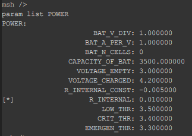
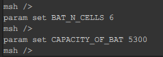
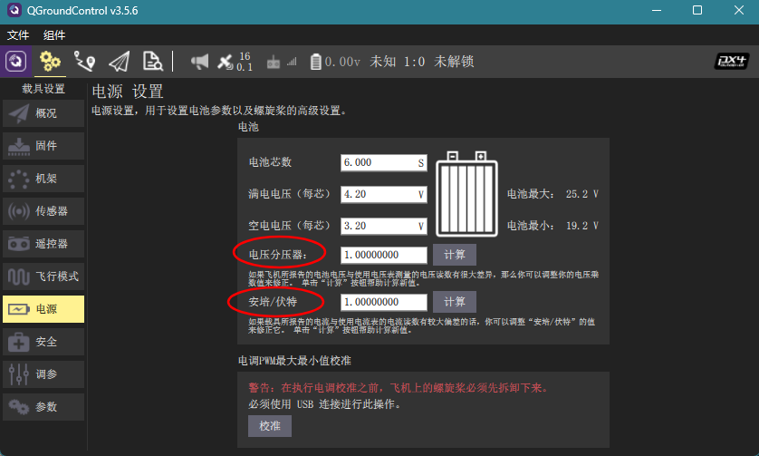
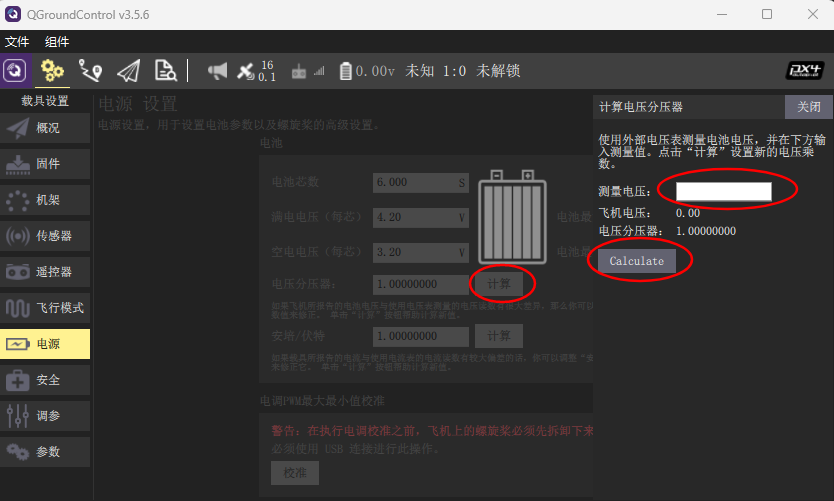
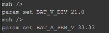
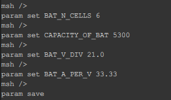

# 校准电池

为了进行准确的电池电量估计，需要根据所使用的电池进行参数校准。

  

首先需要设置电池芯数和电池的容量，比如，当使用的电池为6s,并且容量为5300mAh时，需要输入：

  

以上两个参数需要根据所使用的电池来进行一对一的配对。

然后需要校准分压系数和电流采样的增益系数，这两个系数与所使用的电源模块相关，当更换不同的电源模块或者所测量值与实际偏差过大时需要对这两个参数进行校准。

有两种校准分压系数和电流采样的增益系数的方式。

第一种方式是可以通过设置页面的电池选项来校准。

  

校准分压系数，首先点击对应的校准按键，进入分压系数的校准，用电压表，测量电池电压，输入到测量电压后的输入栏中，点击`Calculate`，完成校准，分压系数会自动更新至参数列表中。

  

> 电流采样的增益系数同理,使用电流表测量实际电流，计算电流采样的增益系数。

第二种方式是可以通过查询所使用的电源模块的介绍手册来获得分压系数和电流采样的增益系数。然后在地面站控制台中通过param set 命令来设置参数。以 Edgi-X / E83 配套电源模块为例(具体内容参考[硬件参数](hardware.md))，其分压系数为21.0，电流采样的增益系数为33.33，那么我们在地面站控制台中输入：

  

最后在地面站控制台中输入`param save`，保存以上校准的参数。

  

