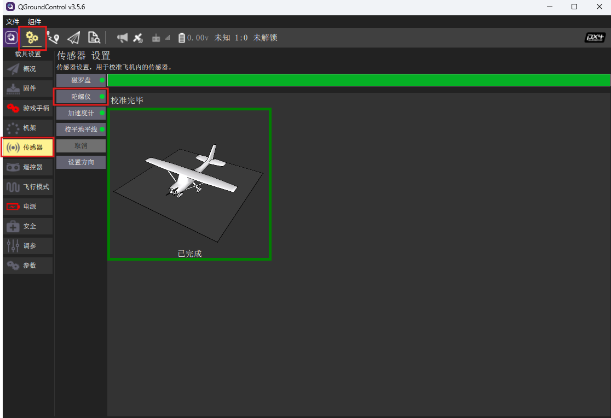
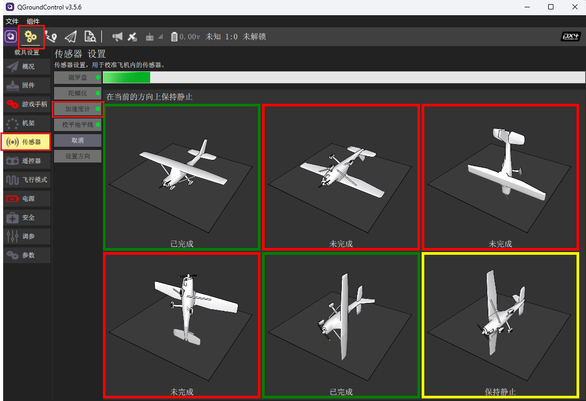
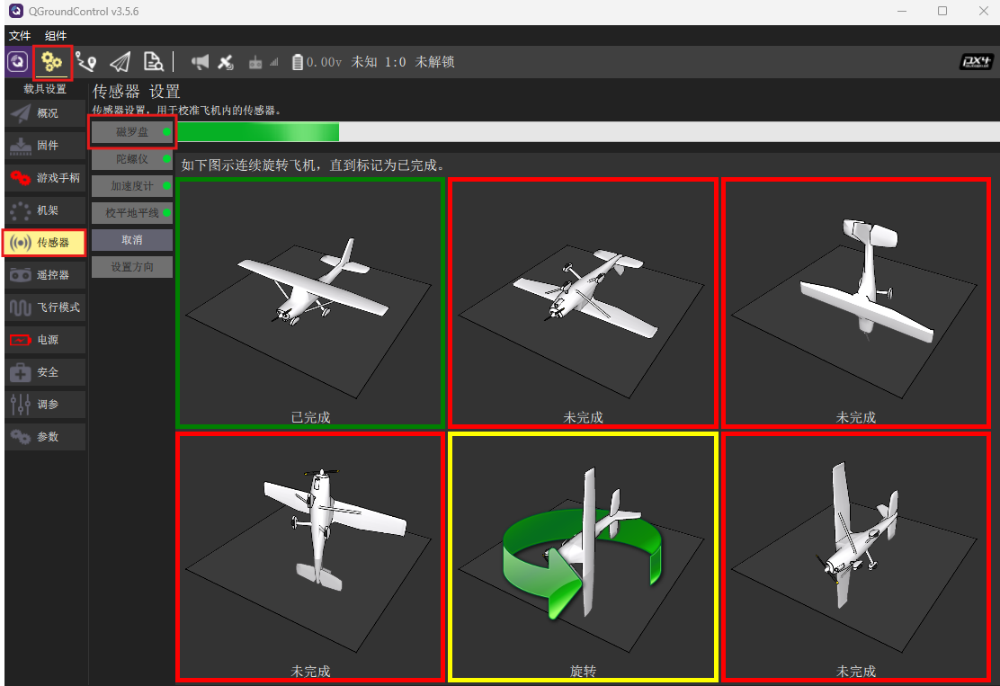

# 校准传感器

一般需校准的传感器有如下几种：

- 陀螺仪
- 加速度计
- 磁罗盘
- 水平校准
- 空速计（仅针对固定翼和VTOL机型）

S1飞控出厂一般已经进行过校准，无需再次校准。若因环境因素变化，如温度、磁场、参数丢失等，导致飞机的传感器数据出现偏移，可以对传感器进行重新校准。这里以新出厂未校准飞控为例，说明如何进行传感器校准。

> 校准顺序会有影响，请按照如下传感器校准顺序进行。

> 校准过程中的警告可忽略，这是由于QGC与FMT部分功能不兼容导致，不影响校准功能。

#### 陀螺仪校准

首先进行陀螺仪校准，校准方法为将飞控静置，点击*载具设置->传感器->陀螺仪*按钮开始校准，等待进度条走完。校准完后，校准参数（`GYRO0_XOFF`，`GYRO0_YOFF`，`GYRO0_ZOFF`）保存在CALIB参数组中，可输入`param list CALIB`查看。

  

> 校准完成后，可以输入`mcn echo sensor_imu0`，查看在静置状态下陀螺仪输出是否接近为0

#### 加速度计校准

然后对加速度计进行校准，校准方法为点击*载具设置->传感器->加速度计*按钮开始校准，并按照图示将飞控依次摆到对应位置静置，等待进度条走完，再摆到下一位置。重复此步骤，直到所有位置的图示都变为绿框。校准的结果可以通过在控制台输入`param list CALIB`指令查看。

  

#### 磁罗盘计校准

然后对磁罗盘进行校准，校准方法为点击*载具设置->传感器->磁罗盘*按钮开始校准，并按照图示将飞控置于所示位置并保持不动，一旦黄色框出现，将飞控沿着指定轴进行旋转。当前方向校准完成后屏幕上对应图标将变为绿框，重复此步骤，直到所有位置的图示都变为绿框。校准的结果可以通过在控制台输入`param list CALIB`指令查看。

  

#### 水平校准

在水平校准前，请先输入`param save`以保存之前所有的校准参数，并输入`reboot`重启飞控以确保校准参数生效。

水平校准是为了消除因为安装问题导致的载具姿态不水平。首先将载具放置在水平地面，查看当前姿态，若姿态距离水平误差较大，则需要进行水平校准。

校准方法为将载具放置在水平地面，然后点击*载具设置->传感器->水平校准*按钮开始校准，等待进度条走完。校准的结果可以通过在控制台输入`param list CALIB`指令查看。校准完成后，输入`param save`保存校准参数，然后重启飞控，查看姿态是否已经水平。