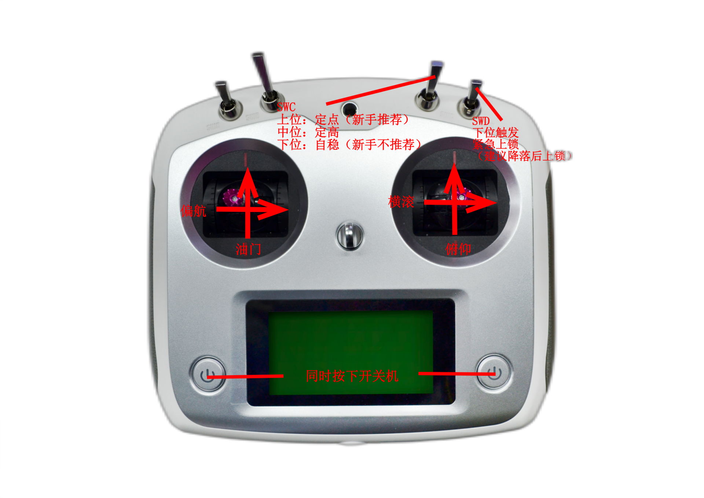
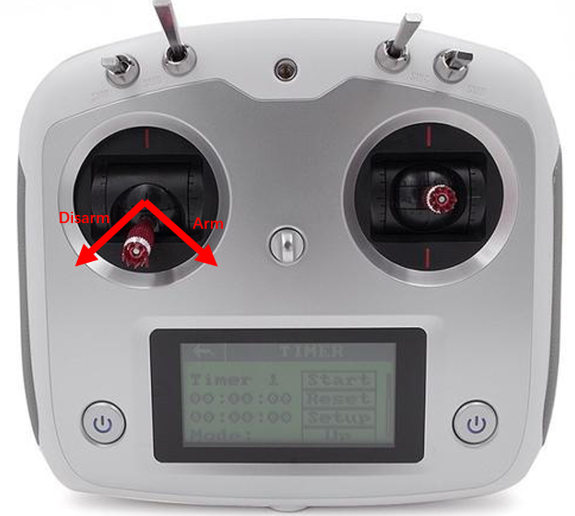
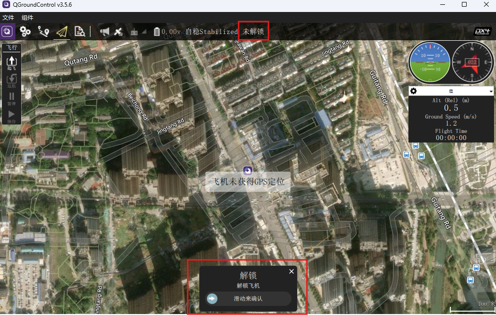

# 检查遥控

首先检查是否收到遥控数据。输入`mcn list`，查看**rc_channels**数据的发布频率是否为非0。

```
msh />mcn list
Topic                 #SUB   Freq(Hz)   Echo   Suspend
-------------------- ------ ---------- ------ ---------
sensor_imu0_0           0     1000.0    true    false
sensor_imu0             1     1000.0    true    false
sensor_mag0_0           0      100.0    true    false
sensor_mag0             1      100.0    true    false
sensor_baro             1      100.0    true    false
sensor_optflow          1       0.0     true    false
sensor_rangefinder      1       0.0     true    false
external_state          0       0.0     false   false
ins_output              3      500.0    true    false
external_pos            1       0.0     true    false
fms_output              4      250.0    true    false
control_output          2      500.0    true    false
pilot_cmd               3      19.8     true    false
rc_channels             0      19.8     true    false
rc_trim_channels        1      19.8     true    false
gcs_cmd                 2       1.0     true    false
auto_cmd                1       0.0     true    false
mission_data            2       0.0     true    false
bat_status              0       2.0     true    false
```


然后检查摇杆映射是否正确（关于摇杆映射配置请参考遥控配置章节）。映射后的遥控数据通过**pilot_cmd**消息发布，输入`mcn echo pilot_cmd`查看映射后的摇杆数据。将Throttle，Roll，Pitch，Yaw摇杆分别打到极限位置和中间位置并查看输出的数据是否正确。

> 摇杆打到最下或最左输出应为-1，打到最上或最右输出应为1，打到中间输出应为0。若误差过大，请重新进行遥控校准。

```
msh />mcn echo pilot_cmd
stick_yaw:0.03 stick_throttle:-0.80 stick_roll:0.01 stick_pitch:0.05 mode:5 cmd:[0 0]
stick_yaw:0.03 stick_throttle:-0.70 stick_roll:0.01 stick_pitch:0.05 mode:5 cmd:[0 0]
stick_yaw:0.03 stick_throttle:-0.02 stick_roll:0.01 stick_pitch:0.05 mode:5 cmd:[0 0]
stick_yaw:0.03 stick_throttle:0.87 stick_roll:0.01 stick_pitch:0.05 mode:5 cmd:[0 0]
stick_yaw:0.03 stick_throttle:0.66 stick_roll:0.01 stick_pitch:0.05 mode:5 cmd:[0 0]
stick_yaw:-0.69 stick_throttle:-0.05 stick_roll:0.01 stick_pitch:0.05 mode:5 cmd:[0 0]
stick_yaw:-0.81 stick_throttle:-0.02 stick_roll:0.01 stick_pitch:0.05 mode:5 cmd:[0 0]
stick_yaw:0.03 stick_throttle:0.03 stick_roll:0.01 stick_pitch:0.05 mode:5 cmd:[0 0]
stick_yaw:0.87 stick_throttle:-0.18 stick_roll:0.01 stick_pitch:0.05 mode:5 cmd:[0 0]
stick_yaw:0.03 stick_throttle:-0.09 stick_roll:0.03 stick_pitch:0.02 mode:5 cmd:[0 0]
stick_yaw:0.03 stick_throttle:-0.09 stick_roll:0.01 stick_pitch:-0.77 mode:5 cmd:[0 0]
stick_yaw:0.03 stick_throttle:-0.09 stick_roll:0.01 stick_pitch:0.89 mode:5 cmd:[0 0]
stick_yaw:0.03 stick_throttle:-0.09 stick_roll:0.01 stick_pitch:0.24 mode:5 cmd:[0 0]
stick_yaw:0.03 stick_throttle:-0.09 stick_roll:-0.83 stick_pitch:-0.01 mode:5 cmd:[0 0]
stick_yaw:0.03 stick_throttle:-0.09 stick_roll:0.04 stick_pitch:0.05 mode:5 cmd:[0 0]
stick_yaw:0.03 stick_throttle:-0.09 stick_roll:0.85 stick_pitch:0.05 mode:5 cmd:[0 0]
stick_yaw:0.03 stick_throttle:-0.09 stick_roll:0.03 stick_pitch:0.05 mode:5 cmd:[0 0]
stick_yaw:0.03 stick_throttle:-0.09 stick_roll:0.01 stick_pitch:0.05 mode:5 cmd:[0 0]
```


接下来检查模式切换是否正常。根据默认的sysconfig设置，SWC（RC通道5）开关拨到上、中、下档，对应的模式为：

- 上：Position位置控制模式
- 中：Altitude定高模式
- 下：Stabilize自稳模式

通过控制台查看飞控的控模式输出跟配置的是否一致。

> 地面站上方显示的模式跟控制台打印的模式可能不一致，这是正常的。因为控制台打印的是遥控器输出的预期模式，地面站上方显示的是无人机当前实际模式。比如预期模式是Position位置控制模式，但是若没有有效的位置传感器，如GPS、光流、外部定位传感器等，则无法进入位置控制模式，飞控会将控制模式降级。

```
[1524961] I/StatusTask: [Pilot Mode] Stabilize
[1528078] I/GCS: set Altitude mode.
[1528085] I/StatusTask: [Pilot Mode] Altitude
[1528582] I/GCS: set Position mode.
[1528589] I/StatusTask: [Pilot Mode] Position
```

然后检查紧急上锁开关是否正常。紧急上锁开关是用于紧急情况下对飞机进行一键上锁，比如飞机无法自动上锁，或者飞机快撞到障碍物或人等紧急情况下使用。

将遥控器SWD（RC通道6）开关从上拨至下，将触发Disarm指令，电机停转，可以通过控制台查看。

> FMT飞控的指令是变化沿有效，故将SWD从上拨至下只会触发一次Disarm指令，如要再次触发，需先将SWD拨回上面，然后再次拨至下面。

```
[1519363] I/StatusTask: [FMS Cmd] Disarm
```

<p align="center">
  
</p>

#### 解锁/上锁

对于飞机解锁操作，将左边摇杆打到右下角不动，如下图所示。大约1.5秒后飞机解锁，电机怠速（Standby）旋转。慢慢推高油门，当油门大于一个阈值（Manual/Acro/Stabilize模式是-0.7，其它模式是0.1），将从怠速进入解锁状态。

怠速模式，将左边摇杆打至左下角不动，大约1.5秒后飞机上锁。飞机解锁后，拉低油门，当飞机触地后，将油门拉至最低，飞机将自动上锁。

<p align="center">
  
</p>


飞机的解锁上锁操作也可通过QGC地面站发送解锁/上锁指令。首先点击下图1所示位置，下方将出现解锁或上锁的滑块（根据当前锁定状态决定），滑动滑块，将触发解锁或上锁的指令。

<p align="left">
  
</p>

> 注意：解锁请注意安全。第一次请先把桨叶卸载再尝试解锁。