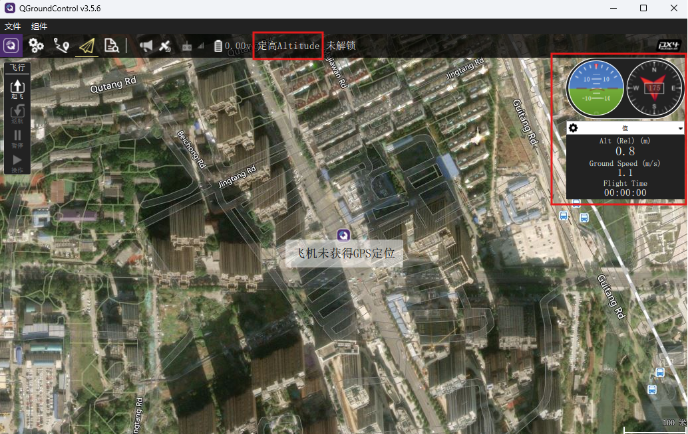

# 状态检查

起飞前，可通过地面站检查无人机的状态信息（如姿态、高度、位置等）是否正常。

另外，还需要检查地面站显示的飞行模式和设置的飞行模式是否匹配。如果它们不匹配，可能是因为传感器数据未达到目标模式要求，导致控制模式降级。例如，如果您已将飞行模式设置为位置模式（Position），但地面站显示为高度模式（Altitude），可能的原因是缺乏 GPS 连接或精度不足，从而无法进入位置模式。

<p align="left">
  
</p>

您可以通过输入 `mcn echo ins_output` 来检查惯性导航系统（INS）的状态。如果 `xy` 标志为零，表示位置信息不可用，这意味着飞行器无法进入位置模式。

```
msh />mcn echo ins_output
timestamp:206396
att: -0.01 -0.03 -0.01
rate: 0.01 0.00 -0.00
accel: -0.10 -0.01 -9.86
vel: 0.00 0.00 -0.00 airspeed:0.10
xyh: -0.06 -0.08 0.05, h_AGL: 0.05
LLA: 0.656730 -2.136100 4.557099 LLA0: 0.656730 -2.136100 4.509699
dx/dlat: 6359226.852620 dy/dlon: 5057753.479151
standstill:1 att:1 heading:1 vel:1 LLA:1 xy:1 h:1 h_AGL:0
sensor status, imu1:1 imu2:0 mag:1 baro:1 gps:1 rf:0 optflow:0
```

