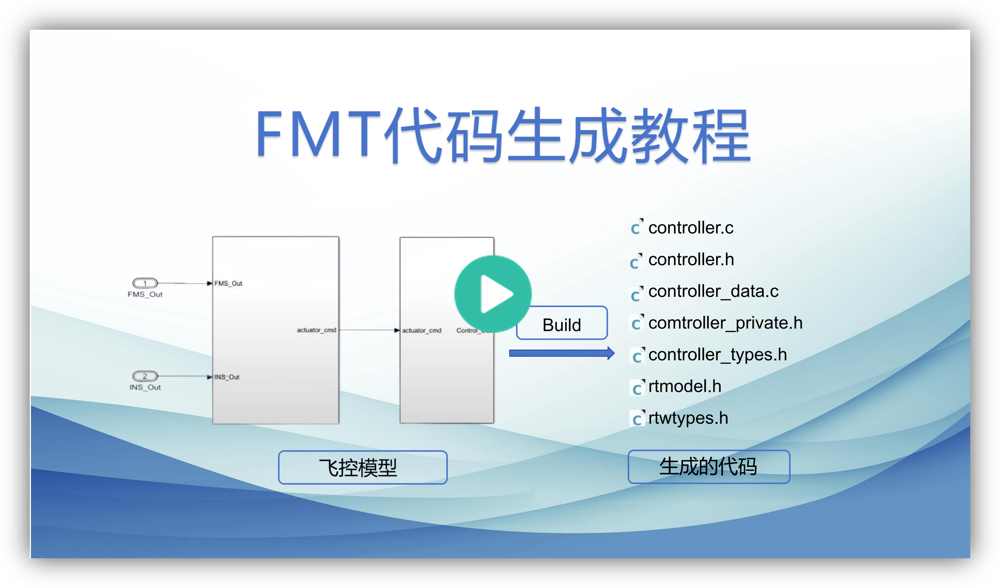
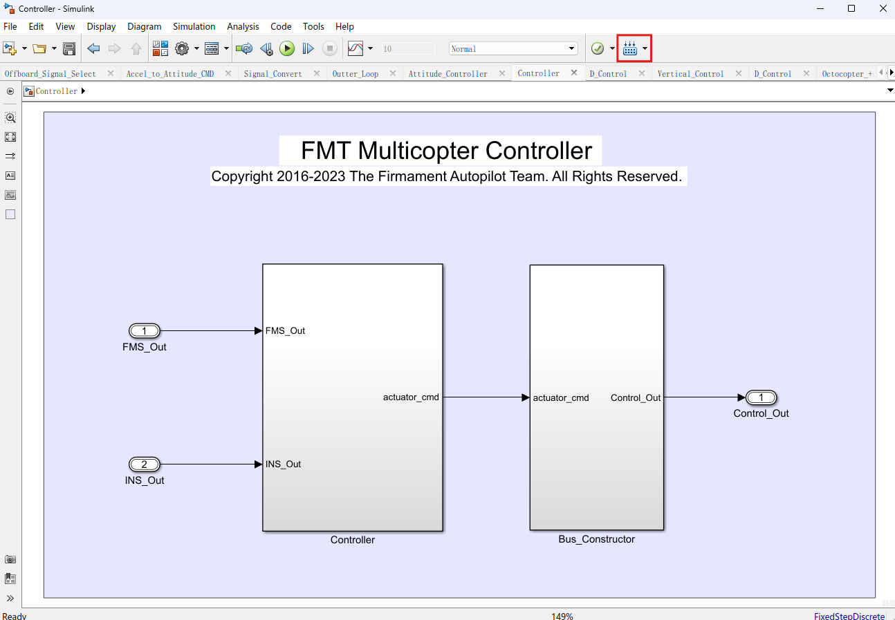
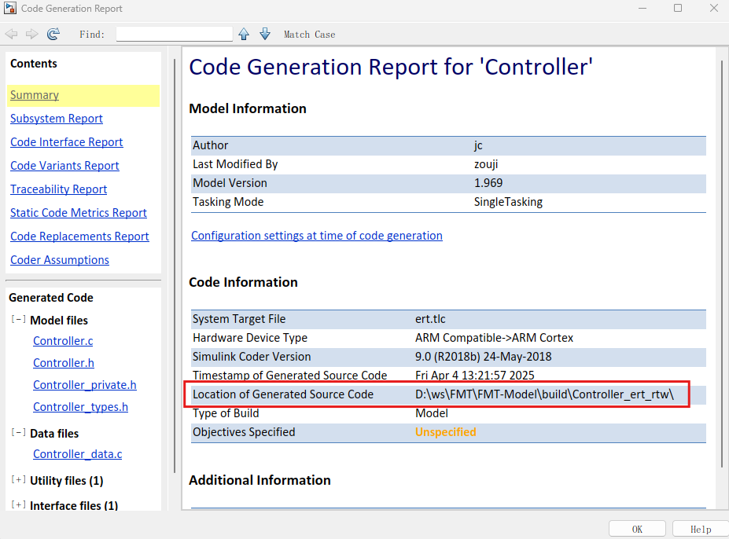
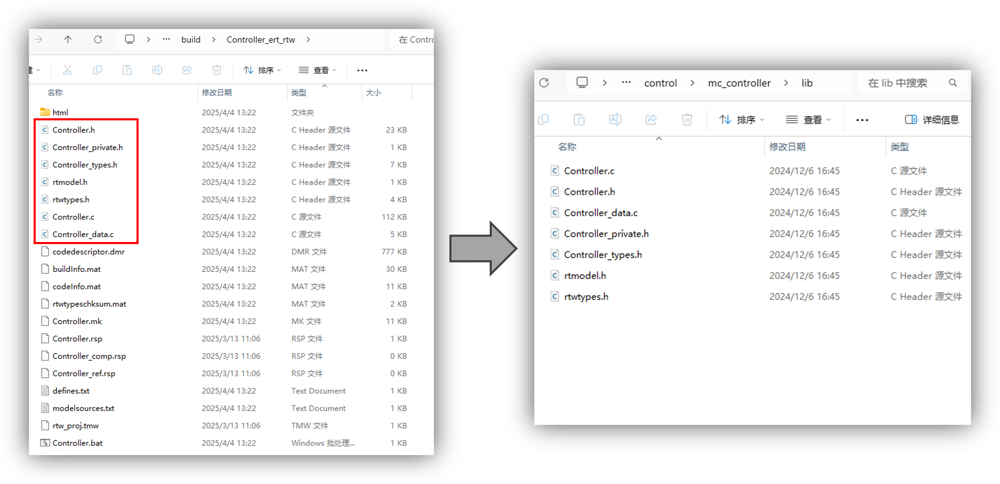
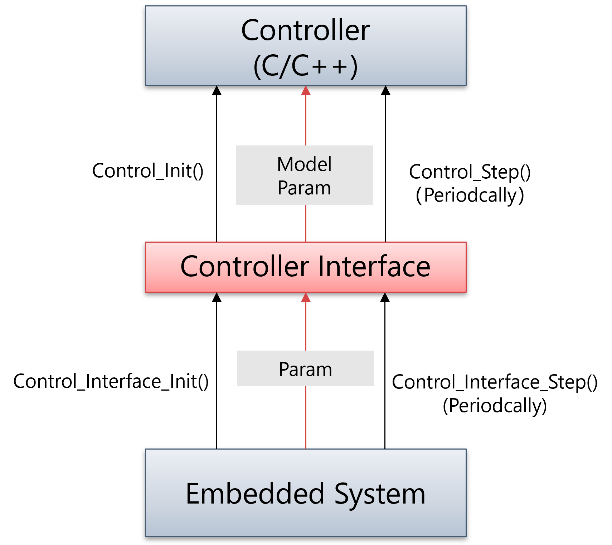

# 自动代码生成

FMT-Model中的模型（Plant，INS，FMS，Controller）可以生成嵌入式C/C++代码，嵌入式到FMT-Firmware嵌入式底软中，从而构成完整的飞控系统。

#### 视频教程

<p align="center">
  <a href="https://www.bilibili.com/video/BV1xf5GzaEhg/?spm_id_from=333.1387.homepage.video_card.click&vd_source=e10fbad513d60d80778c4c6977e370a9" target="_blank">
    
  </a>
</p>


#### 代码生成

以MC-Controller控制器模型为例，演示如何生成代码，其它模型方法类似。首先打开要生成代码的模型，然后点击右上角的**Build**按钮开始编译并生成目标代码。

<p align="center">
  
</p>

完成后将出现如下界面，其中*Location of Generated Source Code*即为生成的代码路径。

<p align="center">
  
</p>

#### 代码部署

将生成的代码路径下的所有.c/.h文件，拷贝到FMT-Firmware的对应model的lib目录下即可。

<p align="center">
  
</p>

对于多旋翼模型，其模型的路径如下所示：

- **INS**: `FMT-Firmware/src/model/ins/cf_ins/lib`
- **FMS**: `FMT-Firmware/src/model/fms/mc_fms/lib`
- **Controller**: `FMT-Firmware/src/model/control/mc_controller/lib`
- **Plant**: `FMT-Firmware/src/model/plant/multicopter/lib`

#### 模型接口

你可能注意到，在每个模型目录下都有`xxx_interface.c`的文件，该文件就是模型接口文件。

模型接口是一个C文件，用于在嵌入式系统和生成的模型文件之间建立连接。模型接口的职责包括：

- 调用模型的 `Init()` 和 `Step()` 函数。
- 订阅模型的输入数据，并发布模型的输出数据。
- 定义模型参数并将其绑定到模型的参数（可选）。
- 定义模型日志数据，用于数据仿真或记录目的（可选）。

<p align="center">
  
</p>

> 若你修改了模型的输入/输出总线，参数，日志等信息，需要对应修改模型接口文件。

#### 编译模型

是否将模型编译进飞控固件由BSP目录下的`model.py`文件进行配置。通过修改这个文件，您可以根据特定的需求和偏好定制需要构建的模型，从而实现对不同载具的控制。

如下是一个示例：

```
# Modify this file to decide which model are compiled
from building import *

vehicle_type = GetOption('vehicle')

if vehicle_type == 'Multicopter':
    MODELS = [
        'plant/multicopter',
        'ins/cf_ins',
        'fms/mc_fms',
        'control/mc_controller',
    ]
elif vehicle_type == 'Fixwing':
    MODELS = [
        'plant/fixwing',
        'ins/cf_ins',
        'fms/fw_fms',
        'control/fw_controller',
    ]
elif vehicle_type == 'Template':
    MODELS = [
        'plant/template_plant',
        'ins/template_ins',
        'fms/template_fms',
        'control/template_controller',
    ]
else:
    raise Exception("Wrong VEHICLE_TYPE %s defined" % vehicle_type)
```

当我们使用`scons -j4 --vehicle=Multicopter`编译固件时候，将使用如下的模型:

```
    MODELS = [
        'plant/multicopter',
        'ins/cf_ins',
        'fms/mc_fms',
        'control/mc_controller',
    ]
```

你可以对其进行修改，以使用其它模型。比如使用ADRC控制器，PX4 EKF导航（C++）：

```
    MODELS = [
        'plant/multicopter',
        'ins/px4_ecl',
        'fms/mc_fms',
        'control/adrc_controller',
    ]
```
