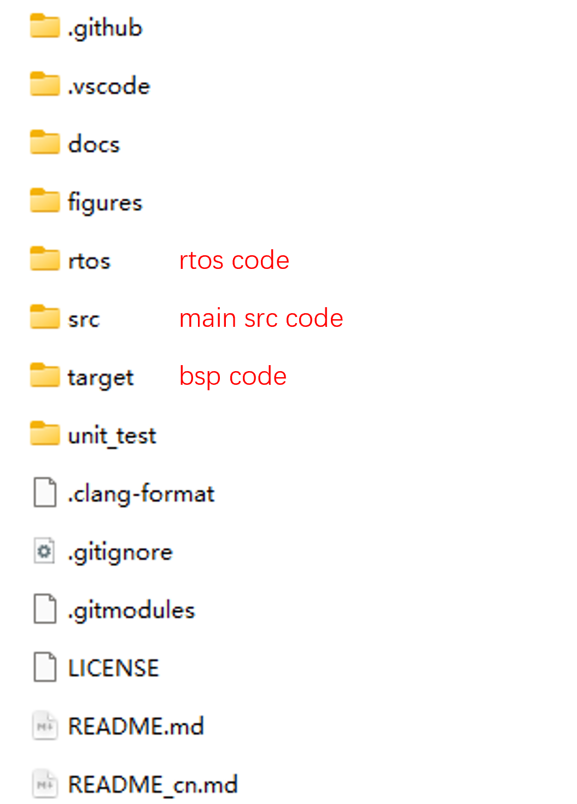

# 代码编译

在编译固件之前，理解 FMT-Firmware 的目录结构非常重要。以下是您在 FMT-Firmware 项目中通常可以找到的典型目录结构的概述：

<p align="center">
  
</p>

目录文件解释：

1. **src/**:这个目录包含固件的主要源代码文件。通常情况下， `startup.c` 文件是固件的入口点。其他目录，例如 `driver`、`hal`、`lib`、`modules` 等，表示固件的不同组件，使其模块化且具有良好的组织性。
2. **rtos/**:在这个目录中，您会找到与 FMT-Firmware 项目中使用的实时操作系统 (RTOS) 相关的代码。具体来说，这个目录包含了RTOS的实现，本项目使用的是 [rt-thread](https://www.rt-thread.io/) RTOS。
3. **target/**:这个文件夹包含了针对固件目标硬件的板级支持包 (BSP)。BSP 是一个关键组件，提供了各硬件平台的外设驱动支持，以让FMT可以在上面运行。
4. **unit_test/**:`unit_test/` 目录包含单元测试的代码，单元测试在固件中起着至关重要的作用，它可以单独测试每个组件或单元，确保其健壮性和正确性。单元测试对于保持固件的可靠性至关重要。

-------------------------------

要了解如何构建和下载固件，可查阅每个 BSP 的 README 文件。README 文件通常提供了详细的步骤、依赖项和配置说明，确保固件成功编译和下载。

## E83 多镜像说明

Edge-E83 工程由 bootloader、M33 和 M55 三部分组成，编译和烧写时需要按如下顺序处理：

1. **bootloader**：位于 `FMT-Firmware/target/infineon/edge-e83/bootloader`，运行在 CM33 安全侧，负责芯片启动、安全镜像签名/校验、系统初始化以及后续应用镜像的加载。它会生成 `build/sign_rtthread.hex`，M33 镜像打包时会引用这个文件。
2. **M33**：位于 `FMT-Firmware/target/infineon/edge-e83/m33`，运行在 CM33 非安全侧，承担系统管理、底层服务、跨核启动/协同等职责。M33 构建会使用 `m33/config/boot_with_extended_boot_scons.json` 对镜像进行重定位和合并，并输出 `build/rtthread.hex`。
3. **M55**：位于 `FMT-Firmware/target/infineon/edge-e83/m55`，运行 FMT 飞控主固件和模型算法，输出 `build/fmt_e83-m55.elf` 和 `build/fmt_e83-m55.hex`。

因此首次构建或完整更新固件时，请按 **bootloader -> M33 -> M55** 的顺序编译：

```
cd FMT-Firmware/target/infineon/edge-e83/bootloader
scons -j16

cd ../m33
scons -j16

cd ../m55
scons -j16
```

如果修改了 bootloader 的配置文件、链接脚本、签名/镜像布局等内容，建议先在 bootloader 目录执行一次清理再重新编译：

```
cd FMT-Firmware/target/infineon/edge-e83/bootloader
scons -c
scons -j16
```

bootloader 重新生成后，建议继续按顺序重新编译 M33 和 M55，确保 M33 打包时引用的是最新的 bootloader 镜像。

在以下说明介绍中，我们将以编译 **Edgi-X / Edge-E83** 飞控作为示例，来阐述固件构建过程。

1. 使用系统终端导航到BSP所在目录：

   ```
   cd FMT-Firmware/target/infineon/edge-e83/m55
   ```

2. 使用scons命令启动构建过程：

   ```
   scons -j4
   ```

   > 使用 `-j4` 标志可以启用并行构建，使用 4 个任务同时进行，加快构建过程并减少编译时间。

   默认情况下，固件是编译X型四旋翼飞行器，等同于执行`scons -j4 --vehicle=Multicopter --airframe=1`，若要编译其他载具或机架类型固件，可参考FMT文档有关[载具/机架](https://docs.sieon.net/fmt/#/content_ch/introduction/frameref)部分的说明。

3. 编译完成后，可在BSP的build目录下看到固件的生成文件。若出现编译错误，可先尝试使用`scons -c`清理下目录，再重新编译。

   ```
   PS D:\ws\FMT\FMT-Firmware\target\infineon\edge-e83\m55> scons -j8
   scons: Reading SConscript files ...
   scons: done reading SConscript files.
   scons: Building targets ...
   scons: building associated VariantDir targets: build
   CC build\board\board.o
   CC build\drivers\drv_pwm.o
   ......
   LINK build\fmt_e83-m55.elf
   Memory region         Used Size  Region Size  %age Used
             FLASH:          ...        16 MB        ...
             SRAM:           ...         4 MB        ...
   arm-none-eabi-objcopy -O ihex build\fmt_e83-m55.elf build/fmt_e83-m55.hex
   arm-none-eabi-size build\fmt_e83-m55.elf
      text    data     bss     dec     hex filename
   1073776  264536 3929312 5267624  5060a8 build\fmt_e83-m55.elf
   scons: done building targets.
   ```

   
