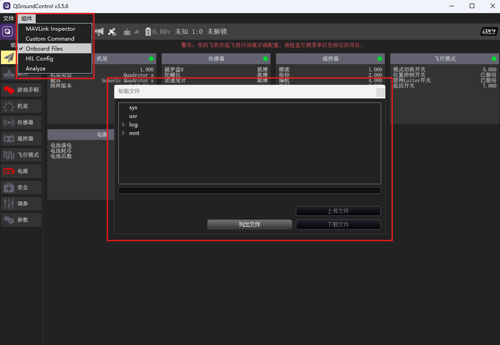
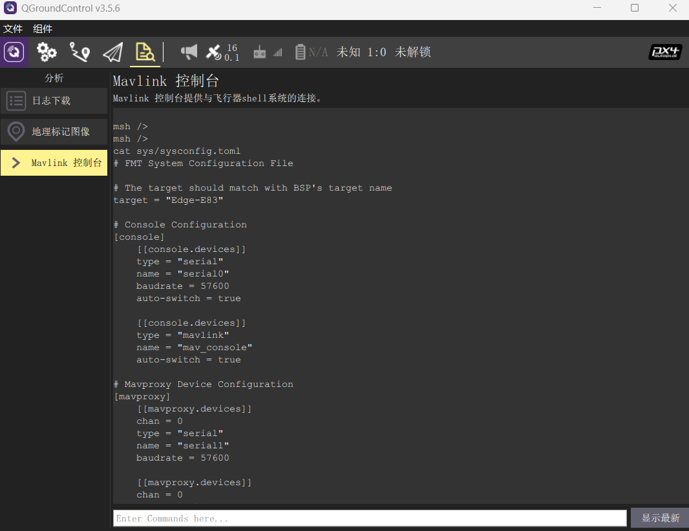

## 上传配置文件

飞控上电会去读取文件系统上的`/sys/sysconfig.toml`配置文件，若该文件不存在，则使用飞控内部默认的`default_config.h`中的配置。由于默认配置未对遥控和PWM输出进行配置，故若未上传配置文件，则遥控器无法使用。

### 上传配置文件

在 E83 的 BSP 目录中（`FMT-Firmware\target\infineon\edge-e83\m55\config`）有提供一个标准的配置文件`sysconfig.toml`，我们可以通过QGC地面站或者使用SD读卡器将其上传到飞控SD卡的/sys目录下。

这里以QGC上传为例，使用Type-C数据线连接飞控到地面站，点击*组件->Onboard Files*按钮，打开FTP文件上传/下载界面。点击*列出文件*按钮，可列出飞控文件系统上的所有文件，如下图所示。

> 只有QGC3.5.6或更低版本才有Onboard Files功能，在高版本的QGC上已经去掉了此功能。故需使用QGC3.5.6来进行文件上传/下载。

    

单击选中*sys*目录，然后点击上传文件，选择`FMT-Firmware/target/infineon/edge-e83/m55/config/sysconfig.toml`，即可将该文件上传到飞控的sys目录。上传完成后，在控制台输入`cat /sys/sysconfig.toml`可查看该文件内容。

    

在控制台输入`reboot`指令或者重新拔插飞控Type-C线重启飞控，即可使新上传的sysconfig.toml配置文件生效。
