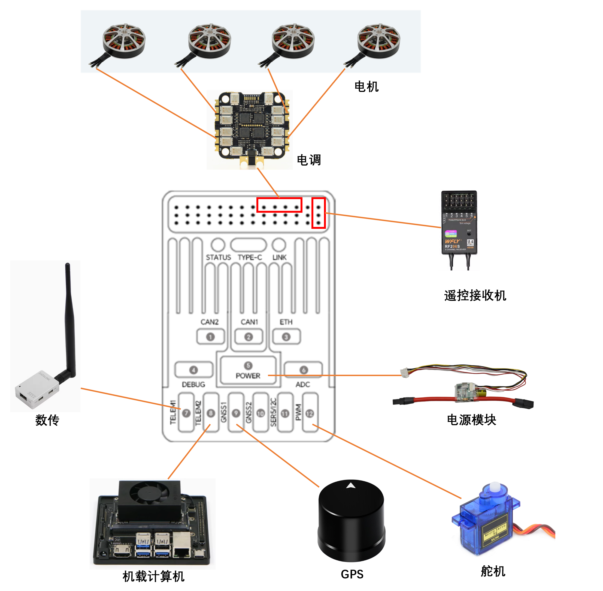

  

| 主要接口      | **功能及用途**                                               |
| :------------ | :----------------------------------------------------------- |
| POWER         | 连接电源PM模块；具有电源输入和电压电流检测功能               |
| ETH           | 以太网口；可连接路由器，以进行网络数据传输                   |
| GPS1/GPS2     | 连接GPS；单GPS连接GPS1；双GPS主GPS接GPS1，从GPS接GPS2        |
| TELEM1/TELME2 | 连接数传等，用于输入和输出MAVLINK数据；TELEM1默认连接地面站，TELEM2默认连接机载电脑 |
| UART/I2C      | 可用于连接UART设备和I2C设备                                  |
| TF CARD       | 插入SD卡，可实现日志存储功能                                 |
| S1~S12        | PWM信号输出口，可用于控制电机或舵机                          |
| PWM           | PWMs信号输入口，可用于捕获PWM电平，也可以配置为PWM信号输出口 |
| DEBUG         | 用于FMU芯片调试，读取DEBUG设备信息                           |
| SPI           | 连接外置SPI设备                                              |
| CAN1/CAN2     | 连接CAN设备                                                  |
| TYPE-C(USB)   | 连接电脑，用于飞控与电脑的通信，比如烧写固件、连接地面站     |
| RC/RSSI       | 连接RC遥控接收机（SBUS/PPM）、RSSI信号输入                   |
| ADC           | ADC输入/输出口，用于读取或输出电压信号                       |