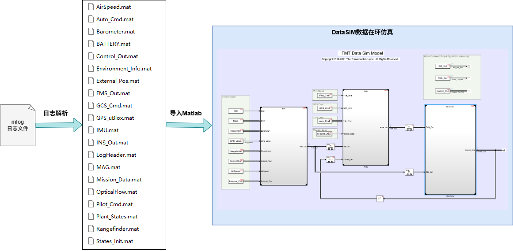
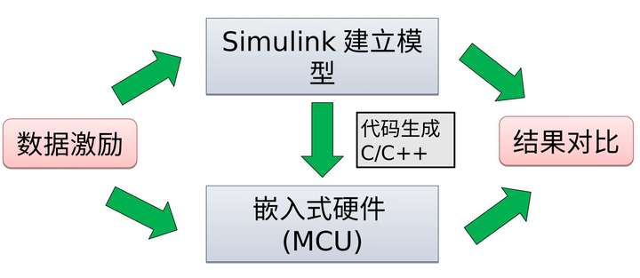
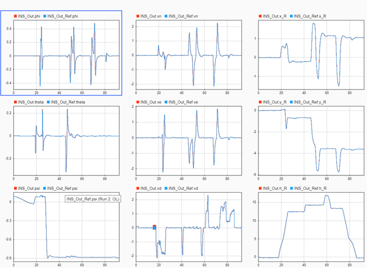

# 数据在环仿真

数据在环仿真（Data-in-loop Simulation，DataSim）是一种强大的数据回溯和分析方法。无人机测试过程中，经常会遇到各种突发情况，但是又很难快速定位到问题的根源，这个时候我们就需要用到数据仿真的方法，它可以通过飞行日志逆向解算出算法运行的全部数据（包括输出信号以及内部信号），定位到问题所在，这样可以极大提升飞控系统的调试和优化效率。

无人机测试过程中，经常会遇到各种突发情况，但是又很难快速定位到问题的根源，这个时候我们就需要用到数据仿真的方法，它可以通过飞行日志逆向解算出算法运行的全部数据（包括输出信号以及内部信号），定位到问题所在，这样可以极大提升飞控系统的调试和优化效率。

  

#### 视频教程

  

#### 仿真结果一致性

数据仿真结果跟实际算法运行结果的一致性是十分重要的，因为只有结果完全一致我们才能信任数据仿真的结果。如下图所示，嵌入式硬件上的算法代码为Simulink模型自动生成，所以算法的逻辑完全一致，而输入数据（数据激励）也是一样的，所以理论上来说数据仿真的输出结果跟实际上运行的结果也应完全一致。而没有采用基于模型开发的飞控系统就很难通过数据回溯的方式获取到全部数据，一般只能拿到日志中记录了的数据，从而需要多次反复测试，耗时耗力。

在实际应用中很难做到数据仿真结果和真实结果完全一致，这主要受限于嵌入式系统的实时性和稳定性，以及记录日志数据的带宽。而FMT可以做到数据仿真的结果跟实际的结果**100%一致**，这得益于FMT嵌入式系统的高效和实时。

  

通过飞控自带的日志系统实时记录少量数据，获得日志文件mlog.bin，通过解析脚本可将日志解析为可导入Matlab的.mat数据文件。通过运行数据仿真模型，即可得到算法模型的所有数据信息，用于问题分析和参数调优。如下是一个数据仿真的结果图，其中红色曲线为数据仿真的输出结果，蓝色曲线为算法的实际输出结果，可以看到两者完全吻合。

  

#### 仿真步骤

- 记录**开机**日志数据，即从飞控上电即开始记录（将MLOG_MODE参数设置为2或3）
- 下载日志，并使用日志解析脚本进行解析
- 将得到的所有*.mat*文件导入Matlab中，并运行预处理脚本（*load_parameter.m*和*mission_data_preprocess.m*）
- 运行DataSIM.slx数据在环仿真模型
