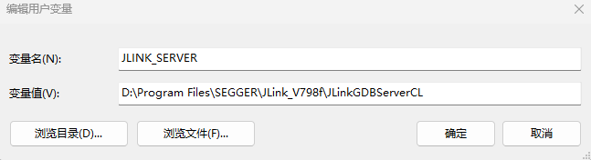
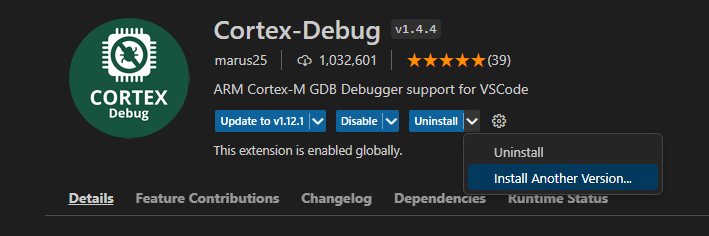
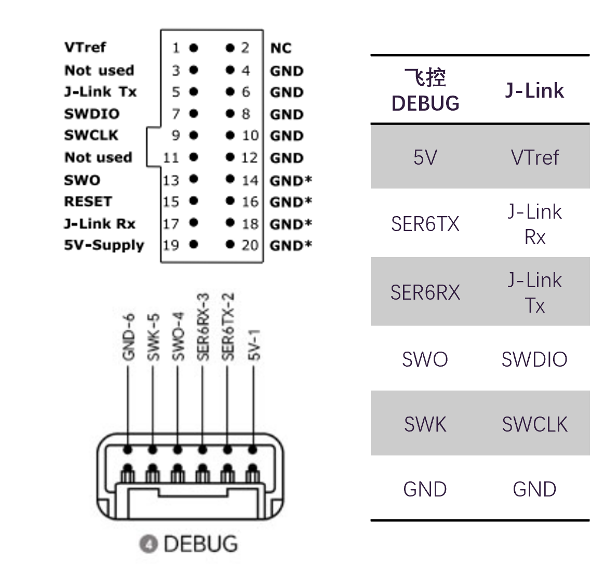
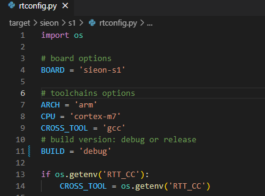
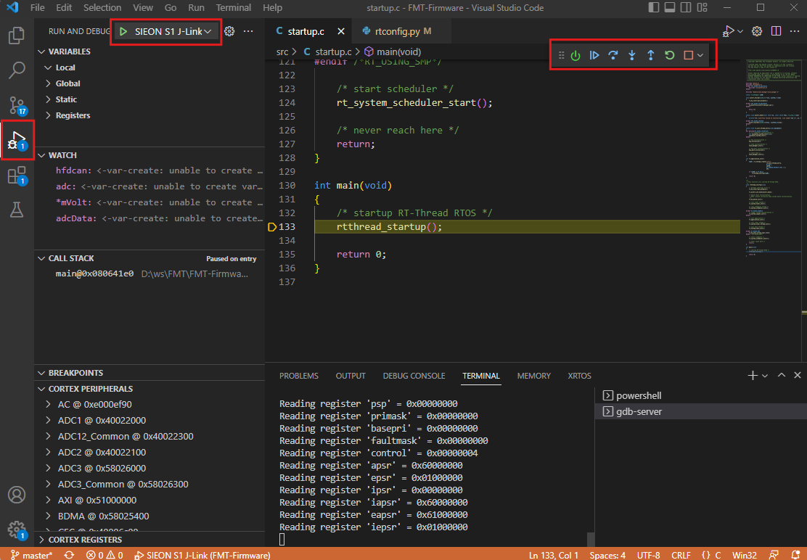

# 代码调试

FMT-Firmware支持通过J-Link进行代码的单步调试，这样有注意问题的分析以及了解代码执行的过程和数据。

#### 调试环境配置

第一次使用时，需要首先配置调试环境。

1. 在你的系统上安装[J-Link Server](https://www.segger.com/downloads/jlink/)。

2. 创建一个新的环境变量`JLINK_SERVER`并将它的值设为J-Link Server的执行文件路径。

   **Linux/Mac**:

   ```
   export JLINK_SERVER=<JLink-Server-Path>/JLinkGDBServerCLExe
   ```

   **Windows**：

   <p align="left">
     
   </p>

3. 在 VSCode 中安装 插件`cortex-debug v1.4.4`或更低版本（高版本不支持arm-gcc 7-2018-q2-update编译器） 。可先安装最新的高版本，然后点击*Uninstall* -> *Install Another Version*。

   <p align="left">
     
   </p>

#### 开始调试

上面我们已经配置好了J-Link的调试环境，可以按照如下步骤来开始单步调试。

1. 连接Jlink SWD的引脚（引脚1,7,9,4）到飞控的Debug端口。连接J-Link Tx/Rx可通过串口终端软件打开serial0控制台。

   <p align="left">
     
   </p>

2. 在BSP目录下的*rtconfig.py*文件中设置`BUILD = 'debug'`并重新编译固件。

   <p align="left">
     
   </p>

3. 要在 VS Code 选择*Debug*页面，并选择对应的目标配置（`SIEON S1 J-Link`），然后点击绿色的**Run**按钮即会下载代码并开始调试。开始调试后在右上角会出现单步调试的按钮栏，可以运行，停止，单步等操作。左边*WATCH*栏可以添加要查看的变量，*CALL STACK*栏可以看到函数调用栈，*CORTEX PERIPHERALS*可以查看芯片外设的寄存器。

   <p align="left">
     
   </p>
