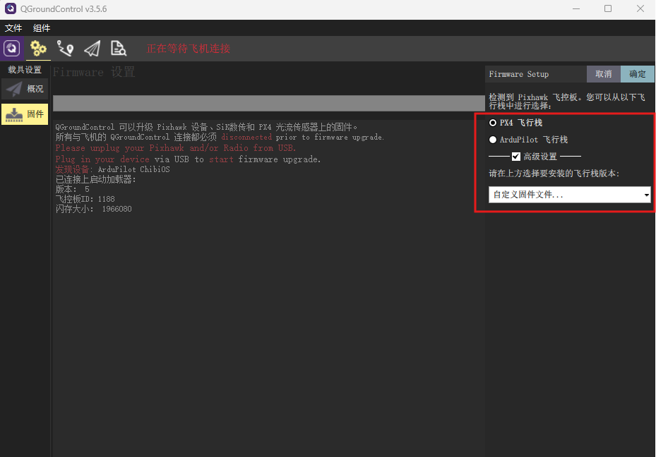

# 固件下载

在编译好固件后，我们需要将编译好的固件下载到飞控硬件中。FMT当前支持**3种下载方式**。


1. **下载脚本**: 在终端中进入BSP目录并输入`python .\uploader.py`，然后使用USB连接飞控硬件到电脑。脚本将自动识别到飞控端口，并开始下载。

   > 注意，需要使用python 3，请确保python 3有正常安装。

   ```
   PS D:\ws\FMT\FMT-Firmware\target\sieon\s1> python.exe .\uploader.py
   waiting for the bootloader...
   wait for connect fmt-fmu...
   Using port COM12 : STMicroelectronics Virtual COM Port (COM12) : USB VID:PID=0483:5740 SER=397837703133 LOCATION=1-2.2.4.4
   Attempting reboot on COM12 with baudrate=57600...
   If the board does not respond, unplug and re-plug the USB connector.
   
   Found board id: 1188,0 bootloader version: 5 on COM12
   sn: 6828e780d4f5008030184823
   chip: 00000000
   family: b'STM32H??????'
   revision: b'?'
   flash: 1966080 bytes
   Windowed mode: False
   
   Erase  : [====================] 100.0%
   Program: [====================] 100.0%
   Verify : [====================] 100.0%
   Rebooting. Elapsed Time 14.638
   ```

   > 如果出现 `"ModuleNotFoundError: No module named 'serial'"`错误, 说明缺少 **pyserial** 组件, 输入`pip3 install pyserial` 进行安装.

2. **QGC地面站下载**: 点击*载具设置*的`固件`界面，然后使用USB将飞控连接到电脑. 在弹出的对话框中选择 *高级设置->自定义固件文件* ，然后选择S1的bin固件(`fmt_sieon-s1.bin`)进行下载。

   <p align="center">
     
   </p>

3. **J-Link**下载: 如果你有JLink，您可以将其插到硬件的DEBUG端口来下载固件。关于如何使用和配置Jlink，请参考[调试](https://docs.sieon.net/fmt/#/content_ch/introduction/debug)章节的内容。

   > 使用JLink请小心不要覆盖掉bootloader!

   <p align="center">
     
   </p>

当系统启动并运行时，系统横幅可以通过 `serial0`（串行控制台）显示，或者可以在 QGroundControl（QGC）的 mavlink 控制台中输入 `boot_log` 来查看。这些信息提供了关于系统状态和配置的重要信息，帮助用户监控系统行为，确保系统正常运行。

```
   _____                               __ 
  / __(_)_____ _  ___ ___ _  ___ ___  / /_
 / _// / __/  ' \/ _ `/  ' \/ -_) _ \/ __/
/_/ /_/_/ /_/_/_/\_,_/_/_/_/\__/_//_/\__/ 
Firmware.....................FMT FW v1.1.0
Kernel....................RT-Thread v4.0.3
RAM.................................512 KB
Target............................SIEON S1
Vehicle........................Multicopter
Airframe.................................1
INS Model....................CF INS v1.0.0
FMS Model....................MC FMS v1.0.0
Control Model.........MC Controller v1.0.0
Task Initialize:
  mavobc................................OK
  mavgcs................................OK
  logger................................OK
  status................................OK
  vehicle...............................OK

```

