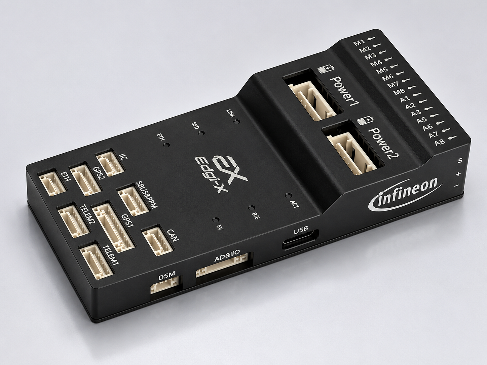

# Edgi-X / Edge-E83使用手册

**Edgi-X**是由FMT、RT-Thread团队联合Infineon打造的一款专业级、高性能的开源自驾仪硬件。该飞控搭载 PSOC™ Edge E83 芯片，具有 Arm Cortex-M55 和 Arm Cortex-M33 双核架构，可实现高性能和细粒度的功率优化。

PSOC™ Edge E83 系列 Arm® Cortex®-M 微控制器兼具高性能与低功耗，并具备安全特性，同时集成先进的机器学习加速功能。该系列 MCU 基于 Arm Cortex-M55，支持 Helium DSP，并搭配 Ethos-U55 NPU；同时配备低功耗 Cortex-M33，适合下一代机器人、无人机和边缘智能应用。

Edgi-X除了提供标准的外部接口，如串口、SPI、IIC、PWM、USB等，还提供CAN总线接口和ETH以太网接口，满足工业场景应用和网络高带宽数据传输场景。

Edgi-X搭载了FMT固件，可用于无人机、无人车、无人船和机器人等应用领域。FMT是下一代开源智驾仪系统，支持基于模型开发（Model-based-design，MBD）。使用MATLAB/Simulink以图形化方式快速搭建算法模型，一键代码自动生成轻松部署到飞控硬件上，大大提高科研和研发效率，是先进算法验证、二次开发的理想平台。

  

    
  

