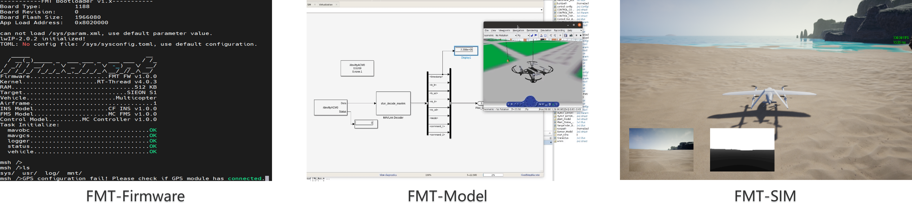
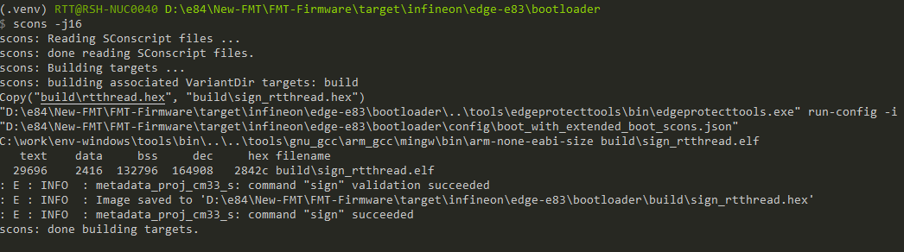
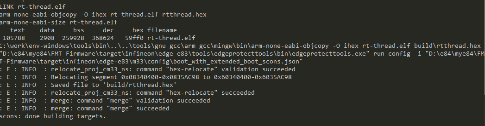
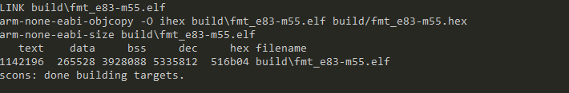
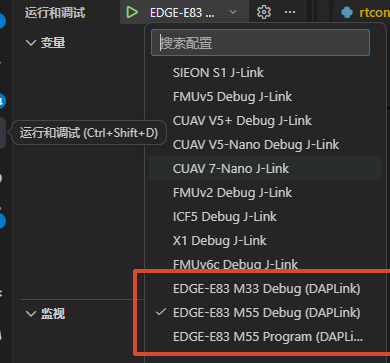
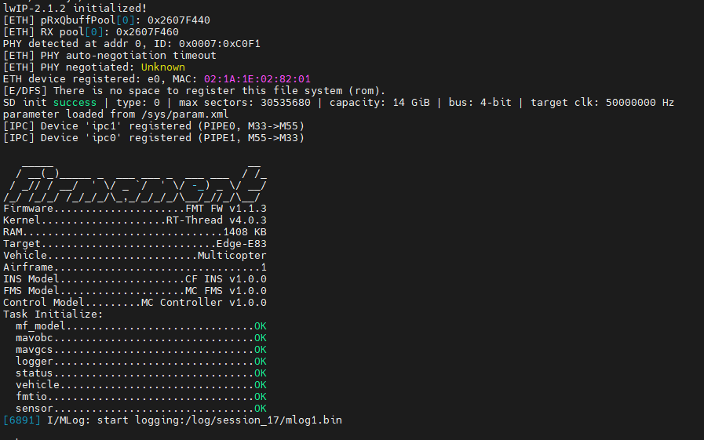
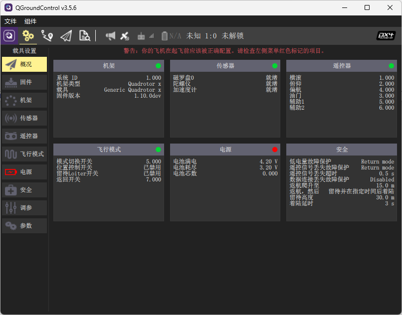
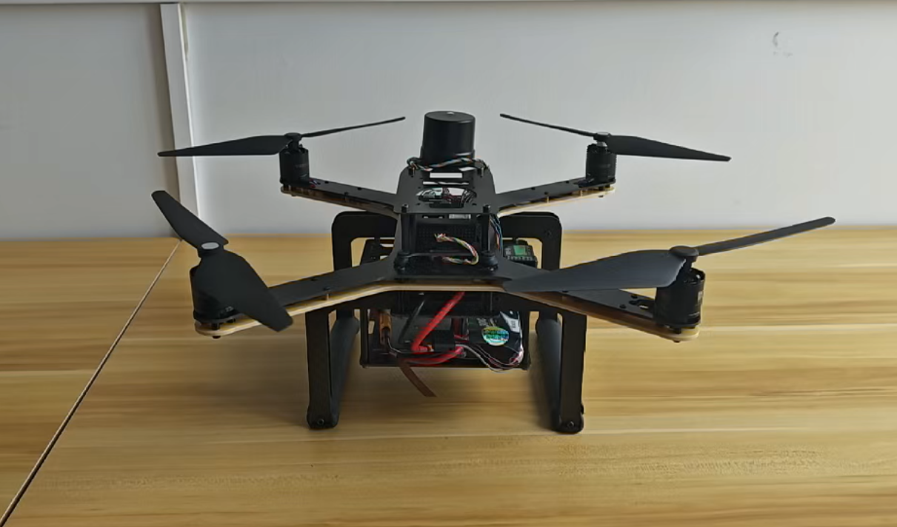

# Edgi-X 智能飞控平台快速上手：从平台认识到固件编译烧录

随着无人机、无人车、无人船和机器人等智能装备快速发展，开发者对飞控平台的性能、开放性和二次开发能力提出了更高要求。Edgi-X 正是在这一背景下推出的智能飞控平台，由 FMT、RT-Thread 团队联合 Infineon 打造，面向高性能控制、边缘智能和算法验证等场景，硬件搭载 PSOC Edge E83 芯片，并运行 FMT 开源自驾仪固件。

<p align="center">
  
</p>

## 一、平台介绍

Edgi-X 是一款专业级、高性能的自驾仪硬件平台。核心芯片 PSOC Edge E83 采用 Arm Cortex-M55 与 Arm Cortex-M33 双核架构，兼顾高性能计算和低功耗系统管理能力。其中 Cortex-M55 支持 Helium DSP，并搭配 Ethos-U55 NPU，适合用于机器学习、边缘 AI、智能感知和复杂控制算法等场景。

在接口资源方面，Edgi-X 除了提供 UART、SPI、IIC、PWM、USB 等常用外设接口，还提供 CAN 总线接口、ETH 以太网接口、GPS、RC/SBUS、AD&IO、SDCard 等扩展能力，可满足工业应用、机器人控制、无人系统通信以及高带宽数据传输需求。

<p align="center">
  
</p>

Edgi-X 的硬件体积小、重量轻，适合安装在空间受限的移动平台上。它既可以作为飞控硬件直接用于无人系统，也可以作为控制算法、传感器融合、通信链路和模型部署的开发验证平台。

## 二、软件资源与已有功能概况

Edgi-X 搭载 FMT 固件。FMT 是下一代开源自驾仪系统，支持基于模型开发，也就是 Model-Based Design，简称 MBD。开发者可以使用 MATLAB/Simulink 以图形化方式搭建算法模型，并通过自动代码生成将模型部署到飞控固件中，适合科研、教学、算法验证和产品原型开发。

目前围绕 Edgi-X / FMT 已经具备较完整的开发和使用链路：

- 固件系统：FMT-Firmware，包含嵌入式飞控主程序、驱动、HAL、RTOS、模块和 BSP。
- 模型开发：FMT-Model，支持 INS、FMS、Controller、Plant 等模型开发与代码生成。
- 地面站连接：支持 QGroundControl 连接、参数查看、参数配置和飞控状态检查。
- 仿真能力：支持模型在环、软件在环、硬件在环和数据在环仿真。
- 配置管理：支持系统配置文件、遥控器配置、作动器配置、以太网配置、GNSS 配置等。
- 调试下载：支持通过 VS Code、DAPLink 和 OpenOCD-Infineon 完成固件烧录与调试。

<p align="center">
  
</p>

## 三、购买链接

> Edgi-X 购买链接：[淘宝链接](https://item.taobao.com/item.htm?id=10734642840220)

## 四、FMT 文档中心

如果想进一步查看硬件连接、首次使用、参数配置、开发环境、固件编译、固件下载和仿真教程，可以直接访问 FMT 文档中心以及FMT代码仓库：

- FMT GitHub 主页：https://github.com/Firmament-Autopilot
- FMT-Firmware 仓库：https://github.com/Firmament-Autopilot/FMT-Firmware

文档中心中已经整理了 Edgi-X 的使用手册，包括硬件参数、接口定义、布线连接、地面站连接、遥控器使用、传感器校准、电池校准、电调校准、模拟飞行、真实飞行和嵌入式开发等内容。

## 五、如何克隆 FMT 固件代码

在开始编译前，需要先准备开发环境。建议提前安装：

- Git
- Python 3
- Arm GCC 工具链
- SCons 构建工具
- VS Code 及 C/C++、Clang-Format 等常用插件

FMT-Firmware 托管在 GitHub，可使用下面的命令克隆代码：

```bash
git clone https://github.com/Firmament-Autopilot/FMT-Firmware.git --recursive --shallow-submodules
```

这里建议保留 `--recursive --shallow-submodules` 参数，因为 FMT-Firmware 依赖子模块，克隆时同步拉取子模块可以减少后续环境问题。

## 六、如何编译 Edgi-X / Edge-E83 固件

Edge-E83 工程由 bootloader、M33 和 M55 三部分组成。首次构建或完整更新固件时，建议分三步完成编译：先编译 bootloader，再编译 M33，最后编译 M55。

构建固件需要使用 RT-Thread Env 工具，可以前往 RT-Thread 官网下载：

https://www.rt-thread.org/download.html#download-rt-thread-env-tool

安装完成后，后续编译命令建议都在 Env 终端中执行。

### 第一步：编译 bootloader

bootloader 位于 `FMT-Firmware/target/infineon/edge-e83/bootloader`，负责芯片启动、安全镜像校验、系统初始化和应用镜像加载。进入 bootloader 目录后执行：

```bash
cd FMT-Firmware/target/infineon/edge-e83/bootloader
scons -j16
```

<p align="center">
  
</p>

### 第二步：编译 M33

M33 位于 `FMT-Firmware/target/infineon/edge-e83/m33`，运行在 Cortex-M33 非安全侧，负责系统管理、底层服务和跨核协同。bootloader 编译完成后，继续进入 M33 目录编译：

```bash
cd ../m33
scons -j16
```

<p align="center">
  
</p>

### 第三步：编译 M55

M55 位于 `FMT-Firmware/target/infineon/edge-e83/m55`，运行 FMT 飞控主固件和模型算法，是飞控主应用所在的位置。最后进入 M55 目录编译：

```bash
cd ../m55
scons -j16
```

<p align="center">
  
</p>

如果只是修改飞控应用或模型算法，通常只需要重新编译 M55：

```bash
cd FMT-Firmware/target/infineon/edge-e83/m55
scons -j16
```

编译完成后，可以在 M55 BSP 的 `build` 目录下看到生成的固件文件：

```text
build/fmt_e83-m55.elf
build/fmt_e83-m55.hex
```

如果修改过 bootloader 的配置文件、链接脚本、签名或镜像布局，建议先清理 bootloader，再重新按 bootloader、M33、M55 的顺序编译：

```bash
cd FMT-Firmware/target/infineon/edge-e83/bootloader
scons -c
scons -j16
```

## 七、如何使用 VS Code 烧录固件

固件编译完成后，推荐直接使用 VS Code 中的 Cortex-Debug 配置完成烧录。FMT-Firmware 已经提供了对应的 `.vscode/launch.json` 配置，脚本目录位于：

```text
D:\e84\mye84\FMT-Firmware\.vscode
```

烧录前需要确认以下准备工作已经完成：

- 已使用 VS Code 打开 `FMT-Firmware` 工程根目录。
- 已安装 Cortex-Debug 插件。
- 已连接 DAPLink 到 Edgi-X 的 DEBUG 接口。
- 已完成 M33 和 M55 固件编译，确保镜像文件已经生成。

Edge-E83 烧录时按 M33、M55 的顺序执行即可。M33 镜像在构建过程中会合并 bootloader，因此不需要单独再烧录 bootloader。

### 第一步：烧录 M33 镜像

在 VS Code 左侧进入“运行和调试”页面，选择 `EDGE-E83 M33 Debug (DAPLink)` 配置并启动。该配置会调用 OpenOCD-Infineon，将 `target/infineon/edge-e83/m33/build/rtthread.hex` 烧录到 M33 侧。

### 第二步：烧录 M55 镜像

M33 烧录完成后，继续选择 `EDGE-E83 M55 Program (DAPLink)` 配置并启动。该配置会将 `target/infineon/edge-e83/m55/build/fmt_e83-m55.hex` 烧录到 M55 侧，也就是 FMT 飞控主固件。

<p align="center">
  
</p>

烧录完成后，重新上电或复位飞控，即可进入固件运行验证环节。

## 八、运行验证

固件烧录完成后，重新上电或复位 Edgi-X。系统正常启动后，可以通过串口终端和 QGroundControl 两种方式确认固件运行状态。

### 方式一：通过串口终端查看启动日志

使用上位机串口工具连接 Edgi-X 的 DEBUG 接口串口，也就是 `serial0` 控制台，即可查看系统启动输出。接线时连接 DEBUG 口中的 TX/RX/GND，引脚定义可参考接口标注图；默认波特率为 `57600`。正常情况下，终端会显示 FMT 固件版本、RT-Thread 内核版本、目标硬件、载具类型、模型版本以及各任务初始化状态。

看到类似 `Target: Edge-E83`、`Vehicle: Multicopter`、`Task Initialize: OK` 等信息，说明固件已经正常运行。

<p align="center">
  
</p>

### 方式二：通过 QGroundControl 连接飞控

也可以使用 QGroundControl 连接 Edgi-X。连接成功后，可以在地面站中查看飞控状态、传感器信息、参数列表，并进行后续的基础配置和调试。

<p align="center">
  
</p>

## 九、上机注意事项

正式上机前，需要先准备一张 SD 卡，并将默认配置文件复制到 SD 卡的 `sys` 目录下：

```text
FMT-Firmware/target/infineon/edge-e83/m55/config/sysconfig.toml
```

如果 SD 卡中还没有 `sys` 目录，需要手动新建该目录，再将 `sysconfig.toml` 放入其中。Edgi-X 上电启动时会自动读取 SD 卡中的系统配置文件，用于加载飞控通信、传感器、执行器等相关配置。

完成固件烧录和 SD 卡配置后，再进行装机与功能检查。首次上机建议按以下顺序操作：

- 确认供电、电源模块、串口、遥控器、GPS、执行器和电机连接正确。
- 上电后先通过串口终端或 QGroundControl 确认系统启动正常。
- 按照文档完成传感器校准、遥控器校准、电池校准和电调校准。
- 在不安装桨叶的情况下测试解锁、模式切换、电机输出方向和执行器响应。
- 所有功能检查无误后，再安装桨叶并进入后续试飞流程。

调试阶段务必保持桨叶最后安装。任何涉及电机输出、解锁测试或参数调整的操作，都应先确保桨叶未安装，避免误动作带来安全风险。

<p align="center">
  
</p>

## 结语

Edgi-X 将 PSOC Edge E83 的双核异构计算能力、边缘 AI 加速能力和 FMT 的开源自驾仪生态结合在一起，既适合无人系统整机开发，也适合飞控算法、模型部署、仿真验证和教学科研。如果你想快速上手，可以从文档中心开始，按“环境搭建 -> 克隆代码 -> 编译固件 -> 烧录验证”的流程完成第一次开发闭环。
