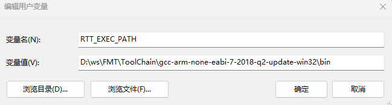
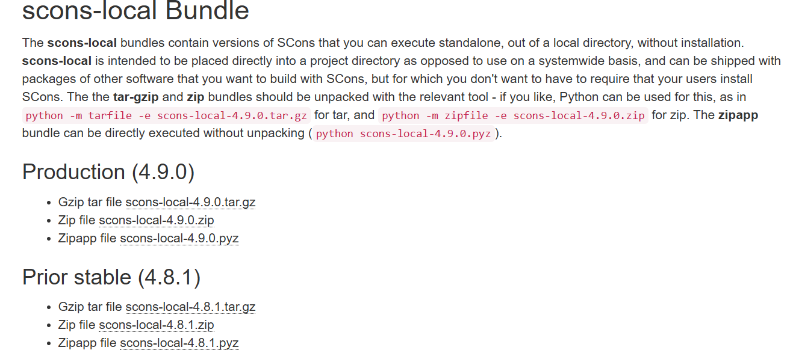
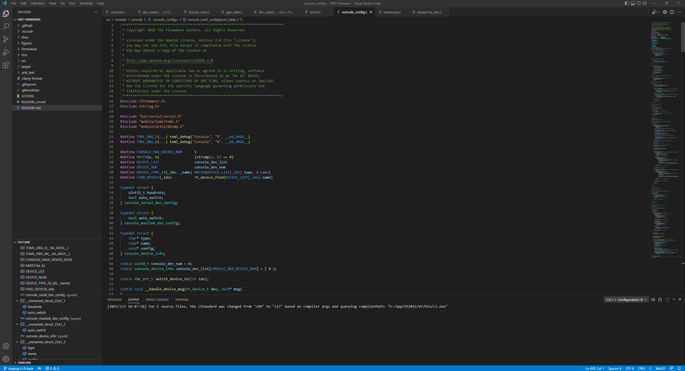
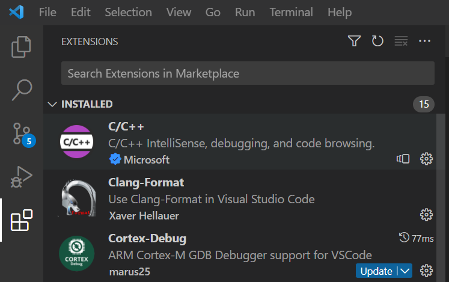

# 搭建开发环境

对于首次使用FMT的用户，需要先搭建开发环境。FMT采用跨平台开发工具链，支持在各种操作系统上开发，例如 Windows、Linux 和 Mac。这种灵活性确保了开发人员无论使用何种平台都能自由地进行项目开发。

FMT开发工具链可在网盘上进行下载，也可网上自行下载。
链接: https://pan.baidu.com/s/1U4_CZvQPasyBq1JRFVhoeQ?pwd=8cux 提取码: 8cux 

#### 获取代码

FMT的代码被托管在[Github](https://github.com/Firmament-Autopilot)。请使用如下指令来拉取FMT-Firmware的代码。

> 下载前请确保您有安装[git](https://git-scm.com/downloads)。

```
git clone https://github.com/Firmament-Autopilot/FMT-Firmware.git --recursive --shallow-submodules
```

#### 编译器

FMT使用**arm-none-eabi- toolchain** `7-2018-q2-update` 版本，可上其 [官网](https://developer.arm.com/tools-and-software/open-source-software/developer-tools/gnu-toolchain/gnu-rm/downloads) 进行下载安装。

> 请务必要使用指定的编译器版本，以防止出现意外错误或不可预见的行为。

编译器下载完成后，下一步是创建一个名为`RTT_EXEC_PATH`的新环境变量，并该变量应指向编译器 bin 目录的完整路径。以下是设置环境变量的方法：

1. 找到编辑器文件夹中包含 `gcc`、`gdb` 等可执行文件的编译器 bin 目录的路径。

1. 将 RTT_EXEC_PATH 环境变量设置为此完整路径。根据您的操作系统，设置过程有所不同：
   - **Windows**:打开控制面板，依次进入“系统和安全 > 系统 > 高级系统设置 > 环境变量”。在“用户变量”下点击“新建”，然后输入变量名为 RTT_EXEC_PATH，变量值为编译器 bin 目录的完整路径。
   
       <p align="center">
         
       </p>
   
   - **Linux/Mac**: 打开终端并编辑 shell 配置文件(例如, `~/.bashrc`, `~/.bash_profile`, or `~/.zshrc`, 确保其在系统开机时会被执行). 在文件中添加以下一行：
   
     ```
     export RTT_EXEC_PATH=<path-to-compiler>/bin
     ```
   
     > 请将<path-to-compiler>替换为你的编译器所在的完整路径

3. 保存文件并运行 source ~/.bashrc（或对应的 shell 配置文件）以使更改生效。 `RTT_EXEC_PATH` 环境变量保存了编译器执行文件所在地路径，以让构建工具可以找到正确的编译器路径。

#### 构建工具

FMT 采用 [SCons](https://scons.org/) 作为其构建工具，SCons是传统 Make 工具的增强版，是一个有效的跨平台的替代方案。SCons 配置文件使用 Python 编写，提供了一种用户友好且强大的方法来解决与构建相关的挑战。Python 的灵活性和易用性使配置构建过程更加直观和高效。使用 SCons，开发人员可以享受到一个能够适应不同平台并且简化以及高效的构建系统。

在安装 SCons 之前，确保系统已经安装了 Python 3 是至关重要的。如果您的系统尚未安装 Python 3，您可以从 [这里](https://www.python.org/downloads/) 下载。Python 是 SCons 的先决条件，因为 SCons 的配置文件是用 Python 脚本编写的。安装完 Python 3 后，您可以继续安装 SCons，以便为项目启用更顺畅和高效的构建过程。

确保您的系统已经安装了Python 3后，在终端中按照以下步骤操作：

1. 下载稳定版的`scons-local`版本（可在本地独立运行，无需安装）。下载完成后解压，然后**将其执行bin目录添加到系统的PATH环境变量**。

   <p align="left">
     
   </p>

2. 安装完成后，打开系统shell控制台，输入以下命令来检查是否成功安装了 SCons，如果在终端上打印出版本信息，说明 SCons 已成功安装，您现在可以将其作为项目的构建工具使用了。

   ```
   PS C:\Users\zouji> scons --version
   SCons by Steven Knight et al.:
        SCons: v4.4.0.fc8d0ec215ee6cba8bc158ad40c099be0b598297, Sat, 30 Jul 2022 14:11:34 -0700, by bdbaddog on M1Dog2021
        SCons path: ['C:\\Users\\zouji\\AppData\\Local\\Programs\\Python\\Python311\\Lib\\site-packages\\SCons']
   Copyright (c) 2001 - 2022 The SCons Foundation
   ```

   

#### 集成开发环境

F推荐使用 Visual Studio Code (VS Code) 作为FMT集成开发环境（IDE），可以从官方网站下载 [VS Code](https://code.visualstudio.com/)。

VS Code 提供了强大且用户友好的开发环境，具备广泛的扩展和功能，非常适合处理像 FMT 这样利用 SCons 作为构建工具的项目。

要在 Visual Studio Code 中打开 FMT-Firmware 项目的代码，请按照以下步骤操作：

1. 打开 Visual Studio Code。
2. 在左上角点击 `File` 菜单。
3. 从下拉菜单中选择 `Open Folder`。
4. 将会出现一个文件资源管理器对话框。导航到存储有 FMT-Firmware 文件夹的位置。
5. 选择 FMT-Firmware 文件夹，然后点击 `打开`。

<p align="center">
  
</p>

安装有用的 Visual Studio Code (VS Code) 插件可以显著增强您在处理 FMT-Firmware 项目时的开发体验。以下是两个对 FMT-Firmware 项目至关重要的插件：

1. C/C++：这个插件在 VS Code 中为 C 和 C++ 语言提供了优秀的支持，包括代码高亮、智能感知、代码导航以及专为这些语言定制的调试能力。
2. Clang-Format: Clang-Format 是用于 C、C++ 和其他编程语言的代码格式化工具。在 VS Code 中使用 Clang-Format 插件可以根据特定的风格指南自动格式化您的代码，确保代码一致性和可读性。

要安装这些插件，请按照以下步骤操作：

1. 打开 Visual Studio Code。
2. 点击左侧边栏上的“扩展”图标（或者使用快捷键 Ctrl+Shift+X，macOS 上使用 Cmd+Shift+X）。
3. 在扩展市场搜索栏中输入 `C/C++` 和 `Clang-Format`。
4. 点击每个插件的“安装”按钮。
5. 安装完成后，您可能需要重启 Visual Studio Code 以激活插件。

<p align="center">
  
</p>

