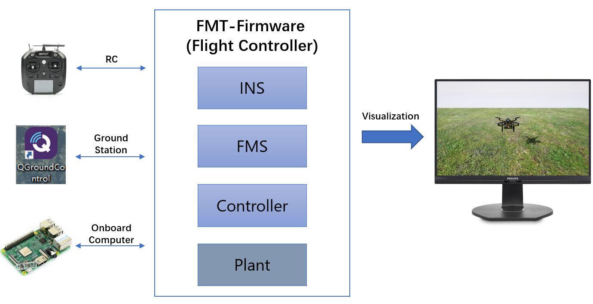
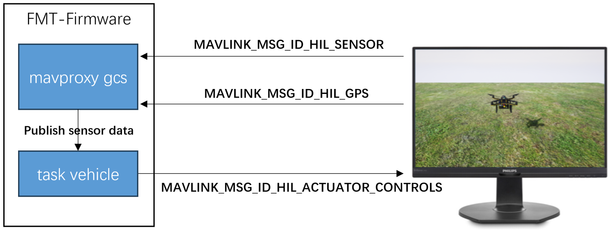
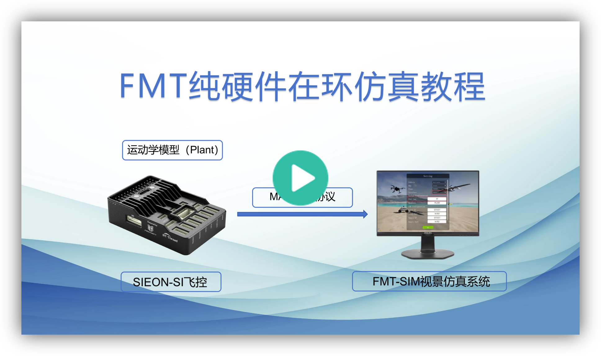
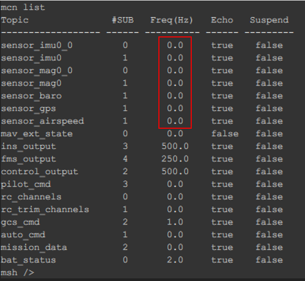
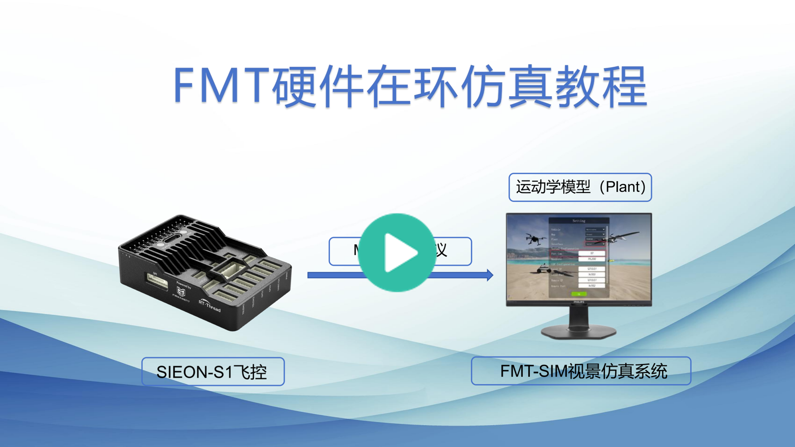
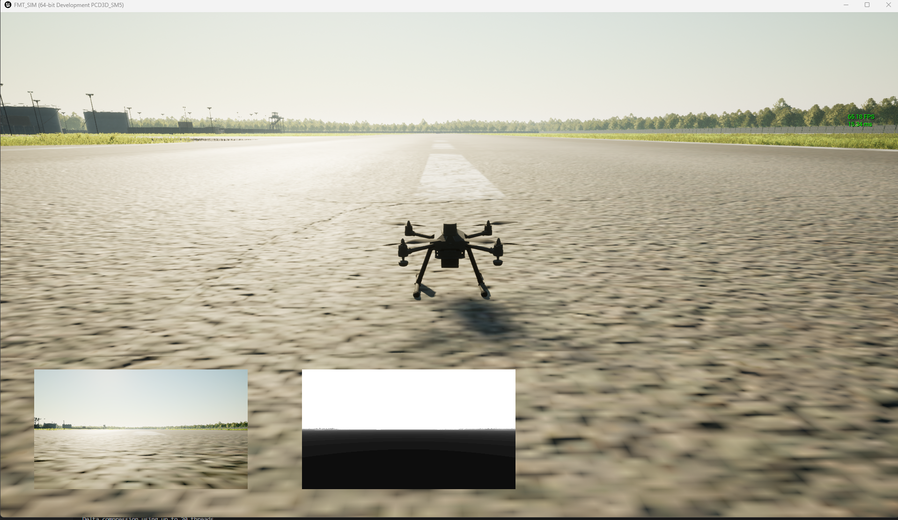
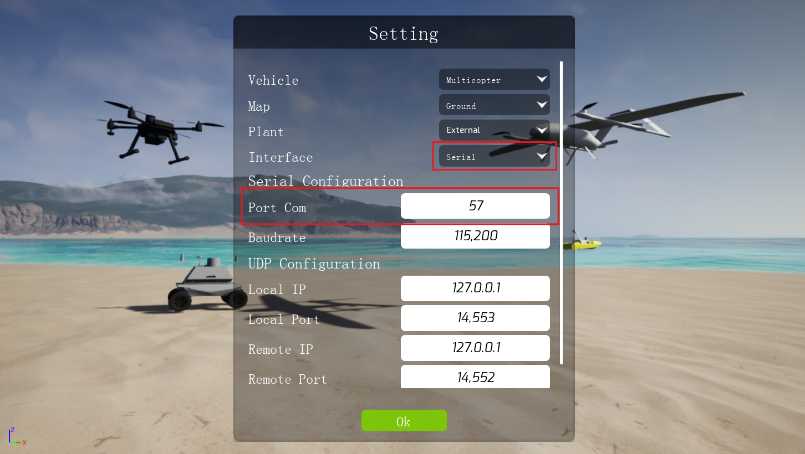
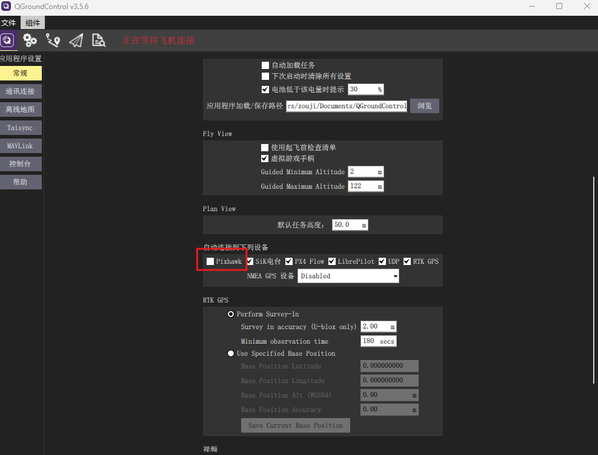

# 硬件在环仿真

硬件在环仿真（Hardware-in-loop Simulation，HIL）是将飞控源代码部署到真实飞控硬件上，不同于控制真机，其是控制一个虚拟的数字飞机。HIL仿真是最接近真实飞行的仿真测试，可以用来验证算法和软件在真实硬件上的效果和性能。

FMT目前支持两种硬件在环的仿真模式：

1. **纯硬件仿真（Simulator-in-hardware，SIH）**：纯硬件仿真 (SIH) 是硬件在环仿真 (HIL) 的一种替代方案。在该配置中，所有的算法都运行在嵌入式硬件平台 - 控制器，导航系统，飞行管理系统以及对象模型。桌面电脑仅用来作为可视化设备。相比于HIL，SIH的虚拟数字飞机模型直接运行在飞控硬件中。因此，用户不需要使用使用专门的仿真主机，而且一般价格昂贵。

   <p align="center">
     
   </p>

2. **传统硬件在环仿真**（HIL）：不同于SIH，HIL中的虚拟数字飞机（Plant）是运行于外部的专门计算机中，其通过数据通信协议，将传感器数据发送给飞控，经由飞控计算控制输出，再传输回来。

   <p align="center">
     
   </p>


#### 使用SIH

在编译项目的时候添加`--sim=SIH`的选项：

```
FMT-Firmware\target\infineon\edge-e83\m55> scons -j4 --sim=SIH
```


当系统上电时，系统输出会包含**Plant Model**信息，这表示SIH仿真模式已激活，被控对象模型已经在飞控上运行。然后，您可以连接GCS和RC来操作SIH仿真，就像操作真实飞行器一样。

```
   _____                               __
  / __(_)_____ _  ___ ___ _  ___ ___  / /_
 / _// / __/  ' \/ _ `/  ' \/ -_) _ \/ __/
/_/ /_/_/ /_/_/_/\_,_/_/_/_/\__/_//_/\__/
Firmware.....................FMT FW v1.1.0
Kernel....................RT-Thread v4.0.3
RAM................................1408 KB
Target............................Edge-E83
Vehicle........................Multicopter
Airframe.................................1
INS Model....................CF INS v1.0.0
FMS Model....................MC FMS v1.0.0
Control Model.........MC Controller v1.0.0
Plant Model.............Multicopter v1.0.0
Task Initialize:
  mavgcs................................OK
  mavobc................................OK
  logger................................OK
  status................................OK
  vehicle...............................OK
[2542] I/StatusTask: SIH Simulation
```

#### 视频教程

<p align="center">
  <a href="https://www.bilibili.com/video/BV1aM55z5Eyn/?spm_id_from=333.1387.homepage.video_card.click" target="_blank">
    
  </a>
</p>


#### 使用HIL

在编译项目的时候添加`--sim=HIL`的选项：

```
FMT-Firmware\target\infineon\edge-e83\m55> scons -j4 --sim=HIL
```


HIL仿真模式下的传感器数据来自外部，所以当未连接外部仿真主机时，飞控没有传感器数据。在控制台中输入`mcn list`命令，可以看到传感器主题的发布频率都是0。

<p align="left">
  
</p>
#### 视频教程

<p align="center">
  <a href="https://www.bilibili.com/video/BV1Xp53zTEN3/?spm_id_from=333.1387.homepage.video_card.click" target="_blank">
    
  </a>
</p>


#### 可视化工具

**FMT-SIM**

FMT-SIM是FMT团队基于UE虚幻引擎开发的3D视景软件，可以用来进行可视化硬件在环仿真。

<p align="center">
  
</p>

首先打开FMT-SIM，在设置界面中选择使用的载具（Vehicle）和地图（Map）。选择载具的被控对象模型（Plant），若是SIH仿真则选择外部（External），若是HIL仿真则选择内部（Internal）。若选择外部模型，则会使用飞控内部运行的Plant，反之，则会使用UE内部的物理引擎来模拟载具。

<p align="center">
  
</p>

另外我们还需将链路（Interface）设置为串口，同时将端口号（Port Com）设置为飞控USB对应的端口号（可在设备管理器查看）。然后点击**Start**即可开始仿真。

如果要连接QGC地面站，需将地面站的自动连接Pixhawk飞控的选项去掉（以免占用FMT-SIM和飞控连接的端口）。FMT-SIM打开后，将自动连接到地面站。

<p align="center">
  
</p>

**AirSim**

FMT支持与AirSim进行仿真。您需要首先下载AirSim，可以选择二进制文件或源代码。有关AirSim的更多信息，请访问 [AirSim官方网站](https://microsoft.github.io/AirSim/)。

安装AirSim后，*User/Documents*目录下会创建一个AirSim文件夹。

打开settings.json文件并将内容更改如下。请注意，您需要将SerialPort更改为连接到您计算机的飞行控制器的端口。

```
{
    "SettingsVersion": 1.2,
    "SimMode": "Multirotor",
    "ClockType": "SteppableClock",
    "Vehicles": {
        "PX4": {
            "VehicleType": "PX4Multirotor",
            "UseSerial": true,
            "UseTcp": false,
            "SerialPort": "COM9",
            "SerialBaudRate": 57600,
            "Parameters": {
                "ROLL_RATE_P": 0.02,
                "PITCH_RATE_P": 0.02,
                "ROLL_RATE_I": 0.05,
                "PITCH_RATE_I": 0.05,
                "ROLL_RATE_D": 0.0005,
                "PITCH_RATE_D": 0.0005
            }
        }
    }
}
```

然后启动AirSim。左上角会显示您已连接到飞行控制器，然后您可以进行控制。

<p align="center">
  
</p>
