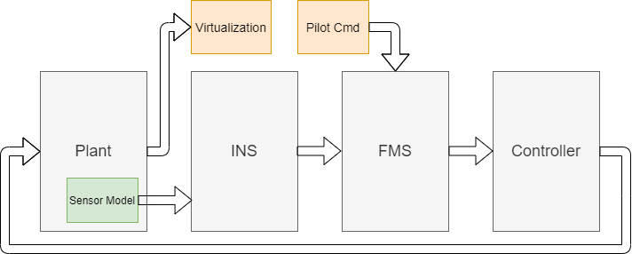
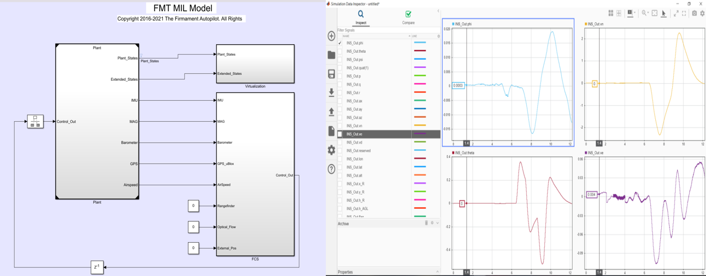
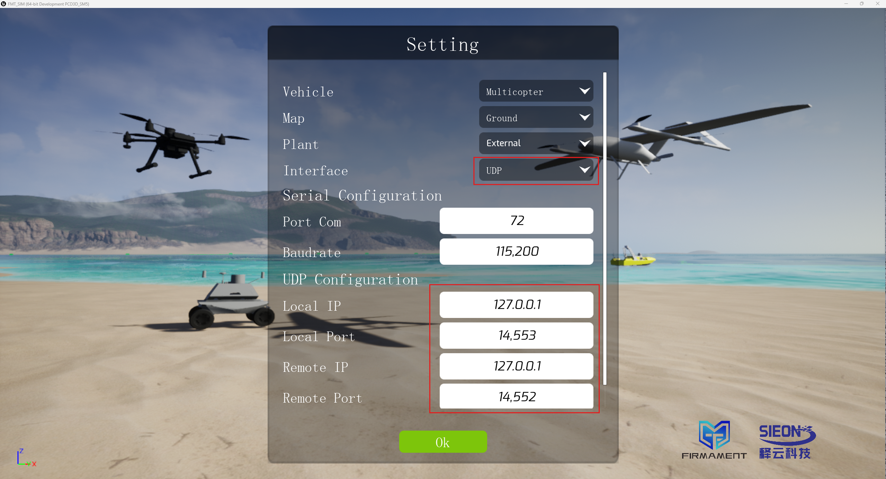
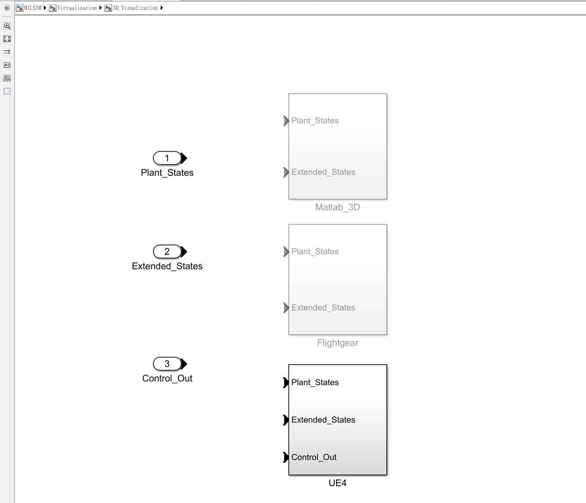
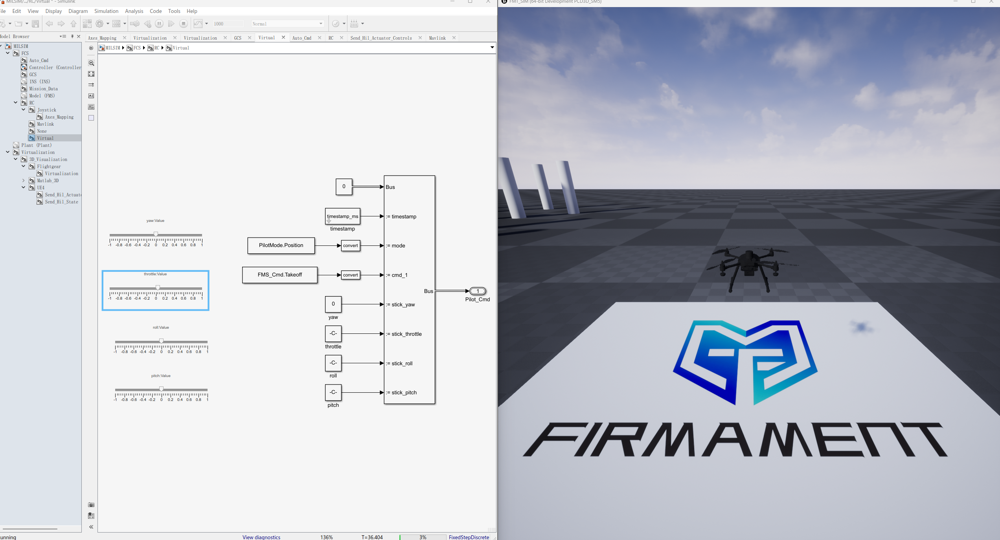

# 模型在环仿真

模型在环仿真（Model-in-loop Simulation，MIL）是在基于模型设计领域早期开发阶段对模型的仿真，是一种高效的算法测试方式。可以在算法开发期间或者开发完成后，通过仿真来验证算法，及时发现算法中存在的问题，以避免直接将算法部署到硬件上运行而导致不必要的损失。通常，通过MIL仿真可以完整90%以上的算法验证工作。

区别于PX4，APM，Betaflight等常见的开源飞控系统，MIL模型在环仿真是FMT所特有的仿真模式。FMT飞控系统构建了从嵌入式软件，运动学与算法建模，数字仿真于一体的软件开发平台，让开发者可以一站式完成开发工作，极大的提升开发效率。

在 Simulink中，一个典型的自驾仪系统模型结构如图所示：

  

可以看到由于引入了被控对象模型Plant，从而构成了一个完整的闭环仿真系统。Plant模拟真实世界中的被控对象，如无人机、车、船等，它接收控制器的控制信号，然后更新状态信息（姿态，速度，位置等）并由其内部的传感器模型生成传感器数据供导航模型进行数据融合。

Plant输出状态信息供Virtualization可视化模块进行3维显示。可视化模块可以使用Simulink自带的Simulink 3D，也可以使用外部的，如UE4，Webots，Gazebo等。

通过外接遥控输入（Pilot Cmd）或者地面站模块（GCS Cmd）或者自行构造输入指令，我们就可以像操控真机一样来对整个系统进行完整功能的仿真。仿真完成后，我们可以通过Simulink Data Inspector来查看任意的数据。

  

#### 视频教程

  

#### 使用FMT-SIM视景系统

MATLAB自带的3D显示效果差强人意，使用FMT-SIM可以获得更逼真的可视化仿真效果。

首先将FMT-SIM的设置中Interface修改为UDP，即通过网络连接，并点击Start按钮。

  

然后将MILSIM的Simulink模型中的3D Virtualization选择为UE4（右键单击->Variant->Label Mode Active Choice->UE4）。

  

运行MILSIM模型，即可自动连接到FMT-SIM。

  

