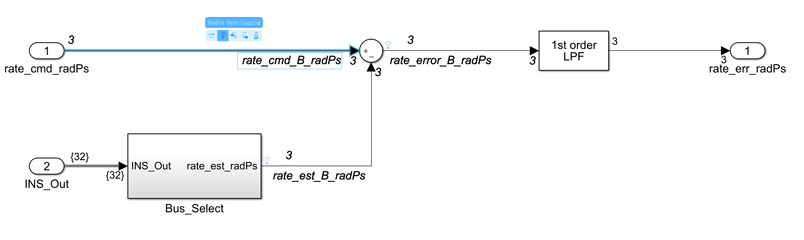
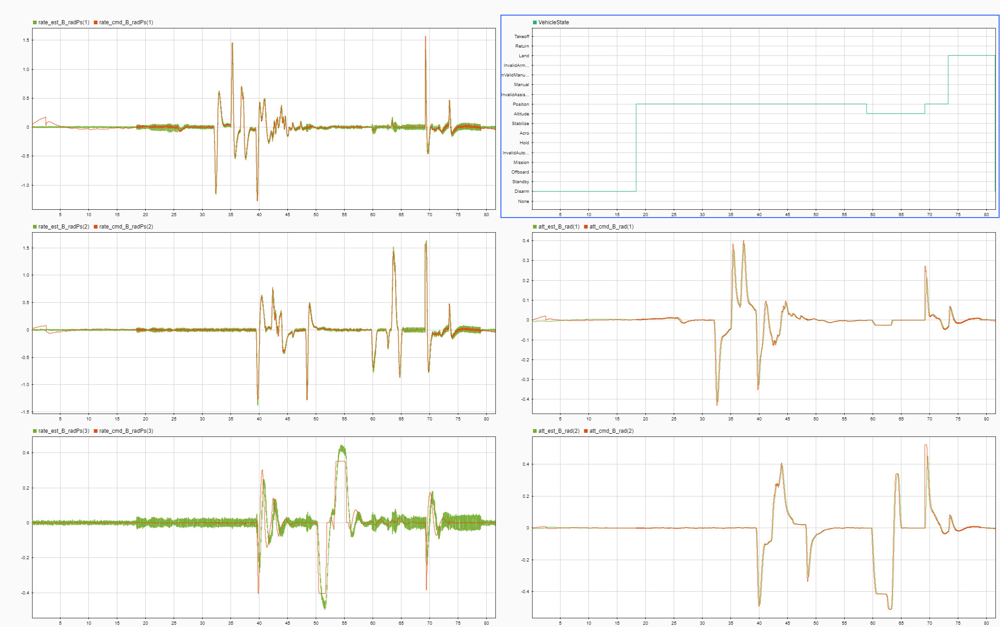
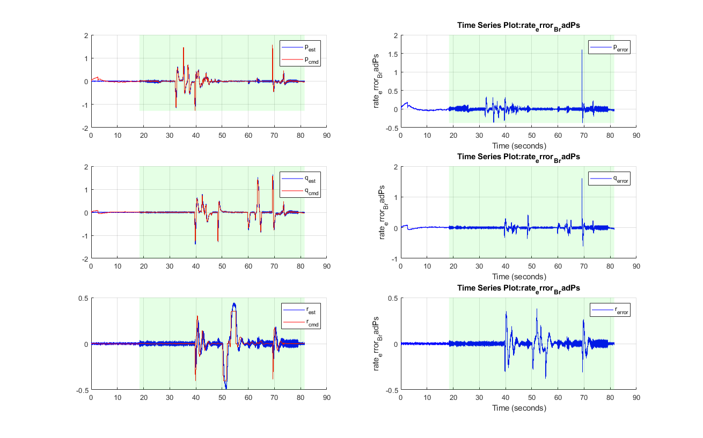

# 离线参数调节

如果要更加深入的分析控制参数以及控制效果，我们需要通过离线参数调节的方式。即通过日志采集飞行的数据，然后进行DataSIM数据在环仿真。数据在环仿真的优势是可以通过仿真得到算法模型内部的所有数据，不用因为某些数据未记录而需要进行反复测试。

本章节将以多旋翼为例介绍离线参数调节的过程，其它载具可类似操作。

#### 查看数据

这里我们不再介绍DataSIM的具体步骤，可以参考数据仿真章节的说明。

首先打开Simulink模型，找到我们需要查看的信号并为其命名。然后单击信号，选择*Enable Data Logging*打开数据记录功能。这样当我们运行数据仿真模型后，被标记的数据将被记录下来。

  

打开Simulink Data Inspector（SDI），在左边搜索栏搜索待查看的信号名称，然后将其加入数据图中进行查看。通过SDI我们可以方便的查看我们所有想要查看的数据，并对其进行局部缩放以及颜色和线形调整等。

  

除了SDI以外，我们也使用使用Matlab自带的强大绘图功能，来绘制数据曲线。在FMT-Model中我们提供了一些m脚本的示例，比如如下所使用的[脚本](https://github.com/Firmament-Autopilot/FMT-Model/blob/master/script/analyze/plotControlResult.m)，就是将角速度环的指令数据、真实数据和误差绘制出来，并且背景为绿色的部分表示飞机是解锁状态。

  

