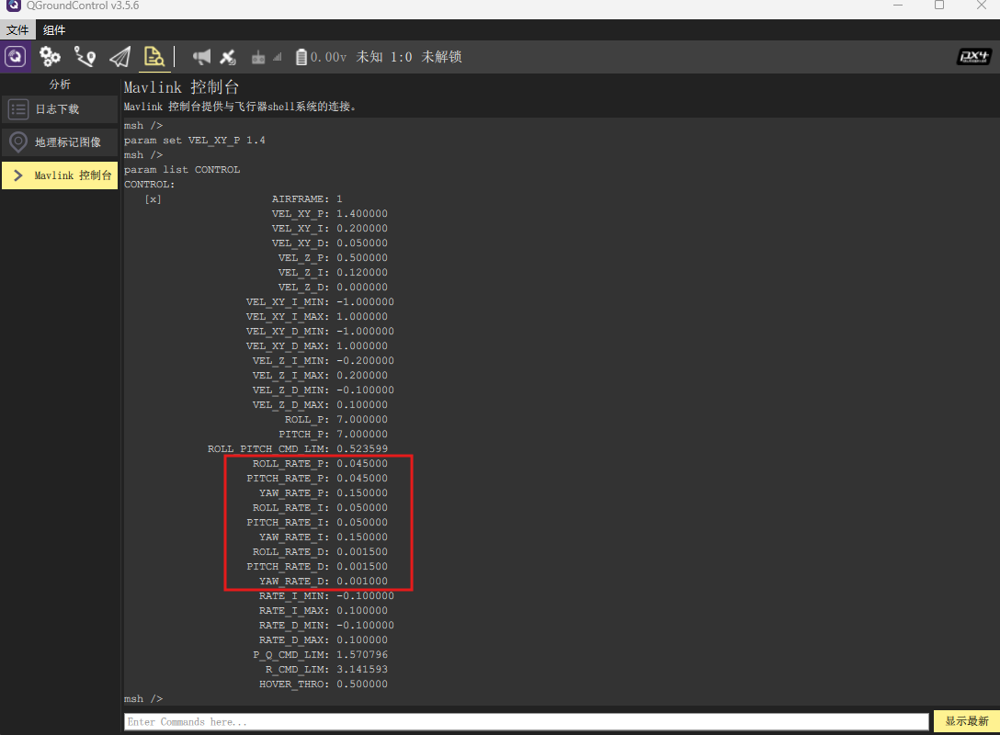
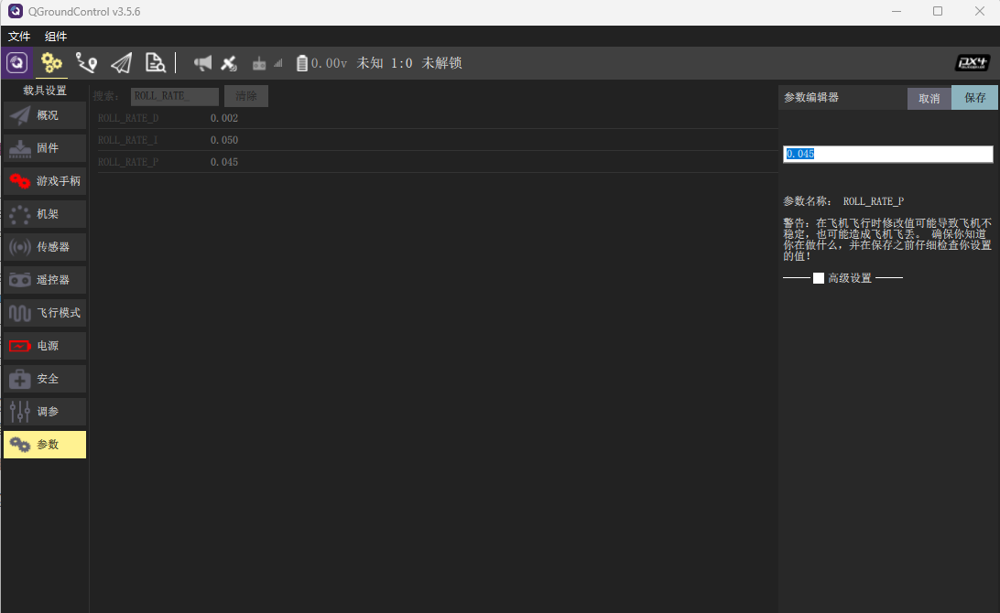
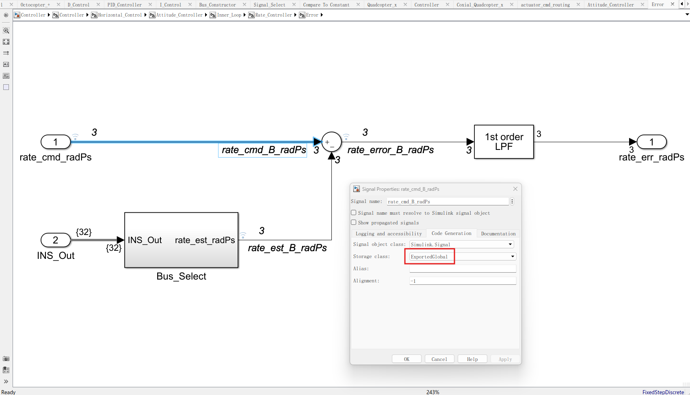
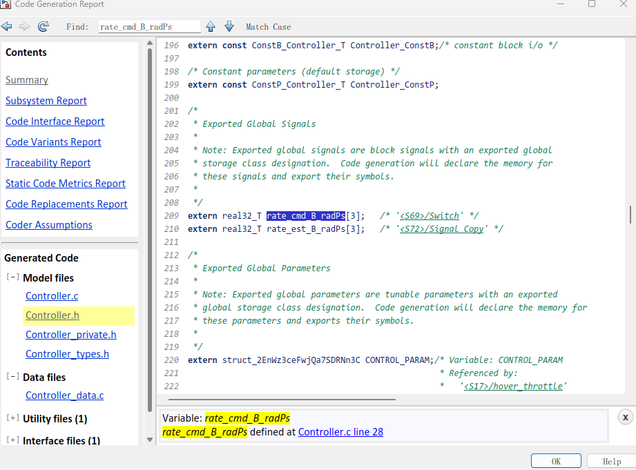
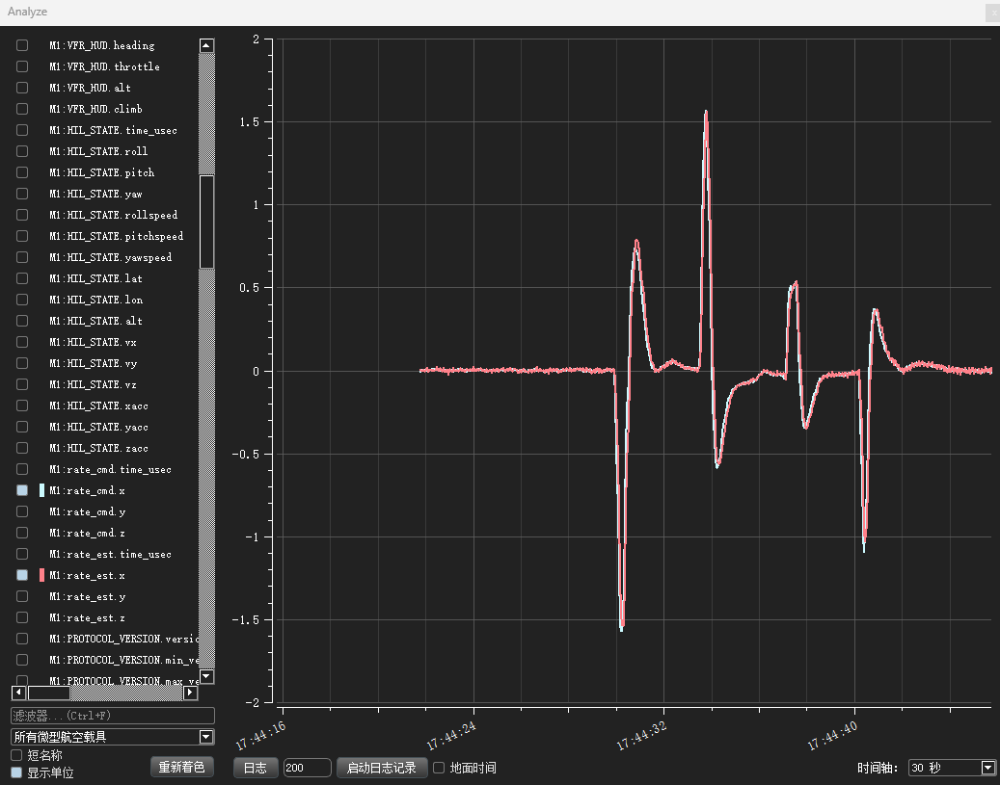

# 在线参数调节

在线参数调节是指直接通过地面站或者飞控终端修改参数值以及查看控制曲线，而无需重新烧写固件或者下载日志的方式来调节参数。这种方法操作相对简便，适合快速参数调节。

本章节将以多旋翼为例介绍在线参数调节的过程，其它载具可类似操作。

#### 修改参数值

一般来说，对于一台新飞机，需要调节的参数仅仅是最内环的控制参数（角速度控制环），当内环调好了，外环如姿态、速度、位置环自然就稳定了。

角速度环参数位于控制器中，关于参数定义可以查看模型的[README](https://github.com/Firmament-Autopilot/FMT-Model/blob/master/model/Controller/MC-Controller/README.md)，如果想要更进一步，可以查看模型源码。

在飞控终端输入`param list CONTROL`可以列出当前控制器模型的所有参数，我们主要关注的是红框圈起来的角速度环的PID参数。

<p align="left">
  
</p>

默认参数主要是针对410轴距的多旋翼无人机，如果无人机飞起来高速抖动，一般是PID参数大了，我们可以通过如下指令将角速度的PID参数对应调小

```
param set ROLL_RATE_P 0.04
param set PITCH_RATE_P 0.04
param set YAW_RATE_P 0.13
param set ROLL_RATE_I 0.04
param set PITCH_RATE_I 0.04
param set YAW_RATE_I 0.13
param set ROLL_RATE_D 0.0013
param set PITCH_RATE_D 0.0013
param set YAW_RATE_D 0.0008
```

你可能注意到了，我们可以通过`param set <parameter> <value>`来设定参数值，其中*parameter*是待修改的参数名称，*value*的新的参数值。注意，如果待修改的值为负数，则需要在其前面加上双斜杠`--`，例如`param set RATE_I_MIN -- -0.1`。

> 关于更多param set的用法，可以输入param set --help。

除了指令以外，我们也可以通过地面站来修改参数，我们可以在地面站的参数界面的搜索框中输入我们要修改的参数名，然后点击该参数即可输入新的数值。

<p align="left">
  
</p>

大部分控制参数修改后即可立即生效（具体请参考模型的README中说明），这意味着你可以在无人机飞行的过程中来实时修改参数，并观察参数的效果。但是这种方式并不推荐新手使用，新手请在飞机上锁状态下修改参数，在保证安全的前提下进行测试飞行。

> 参数修改完成后，若想要在重新上电后依然有效，则需要在飞控终端输入`param save`来保存参数，否则当飞控掉电重启，未保存的参数将恢复原数值。

#### 查看控制曲线

为了观察控制器的控制效果，我们通常需要将控制器的目标信号和实际信号绘制出来。

首先在控制器的Simulink模型中找到要查看的角速度环的目标信号和实际信号，并对其命名。然后右键单击信号线选择*Properties*，将*Storage class*修改为`ExportedGlobal`将其进行导出，以便我们在飞控嵌入式中进行读取。

<p align="left">
  
</p>

重新编译生成Controller的代码，在*Controller.h*中我们将可以看到我们导出的目标信号。

<p align="left">
  
</p>
在*control_interface.c*中的首部添加如下头文件

```
#include "module/mavproxy/mavproxy.h"
```

然后再`control_interface_step()`函数的尾部添加如下一段代码，将信号以50ms周期发送到地面站。

```c
DEFINE_TIMETAG(debug_tt, 50);
if (check_timetag(TIMETAG(debug_tt))) {
    mavlink_system_t mavsys = mavproxy_get_system();
    uint64_t time_usec = systime_now_us();
    mavlink_message_t msg;

    mavlink_msg_debug_vect_pack(mavsys.sysid, mavsys.compid, &msg, "rate_cmd", time_usec, rate_cmd_B_radPs[0], rate_cmd_B_radPs[1], rate_cmd_B_radPs[2]);
    mavproxy_send_immediate_msg(MAVPROXY_GCS_CHAN, &msg, false);

    mavlink_msg_debug_vect_pack(mavsys.sysid, mavsys.compid, &msg, "rate_est", time_usec, rate_est_B_radPs[0], rate_est_B_radPs[1], rate_est_B_radPs[2]);
    mavproxy_send_immediate_msg(MAVPROXY_GCS_CHAN, &msg, false);
}
```

打开地面站的Mavlink Analyze界面，我们可以看到发送过来的信号信息。通过观察目标信号（rate_cmd）和实际信号（rate_est）就可以知道控制的误差，根据误差来实时调节控制参数。

<p align="left">
  
</p>
