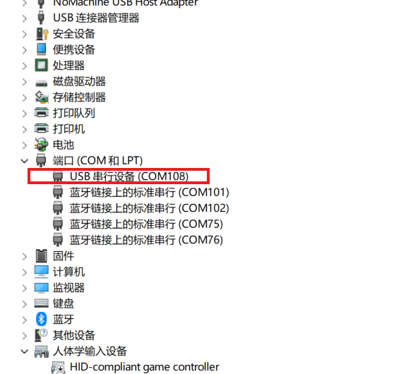
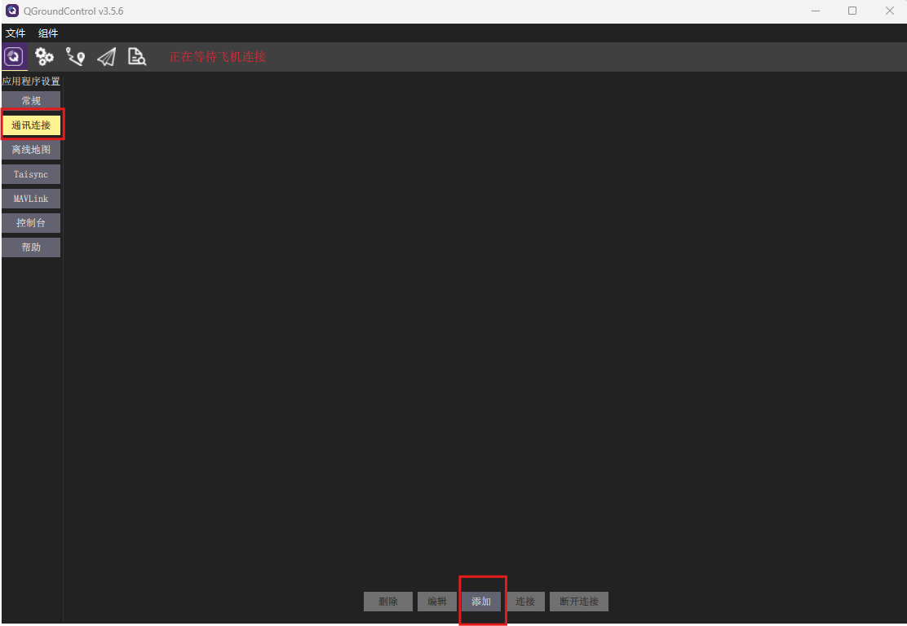
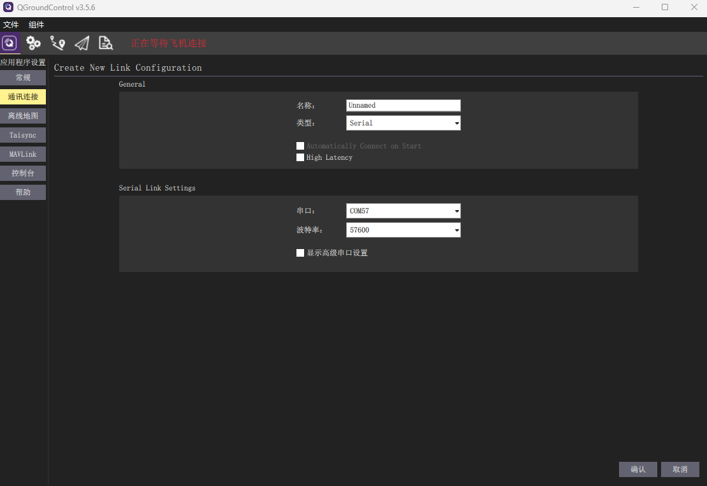
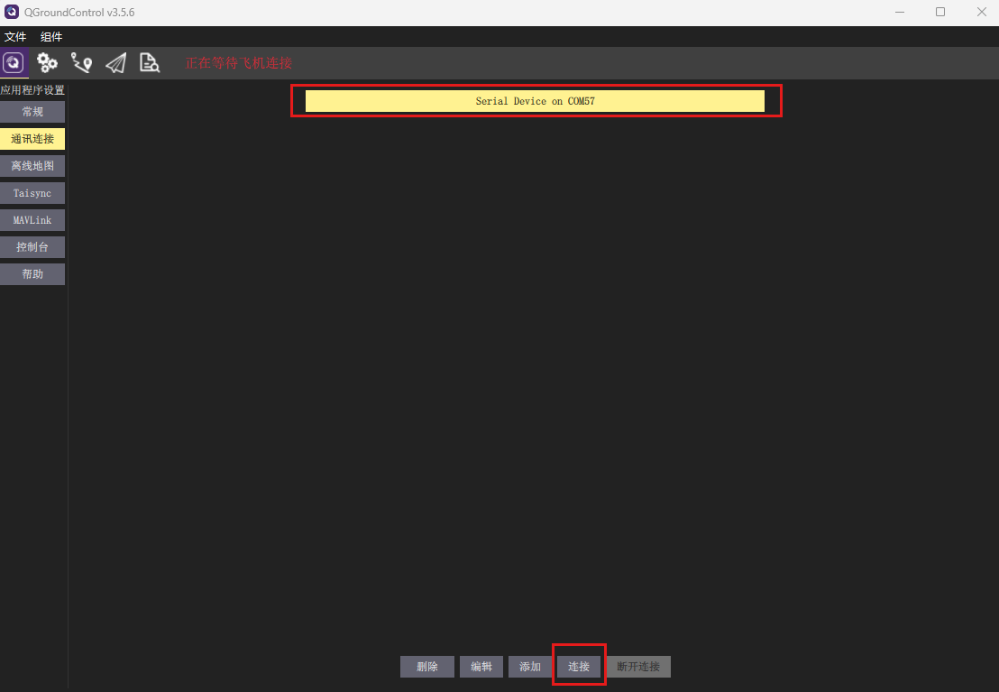
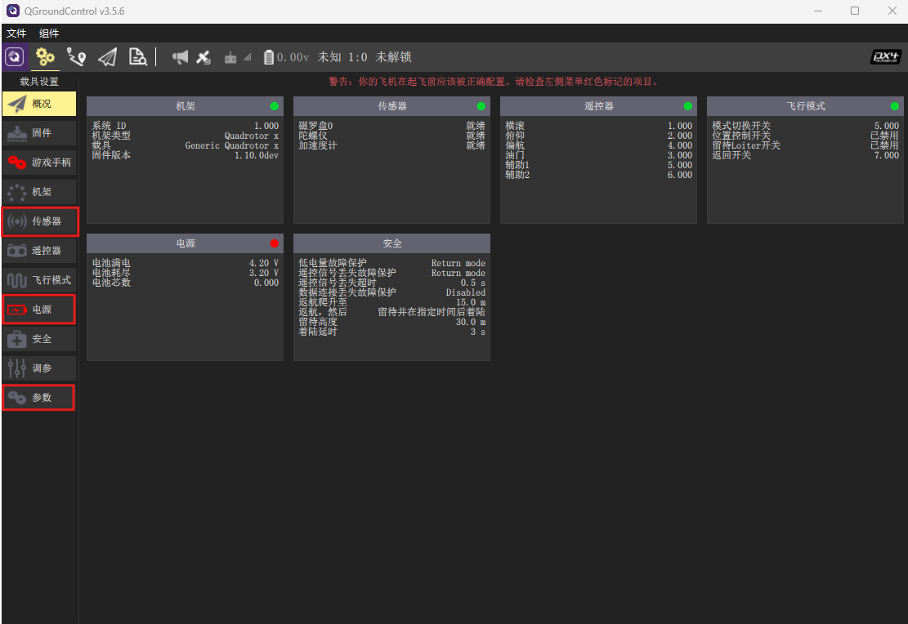
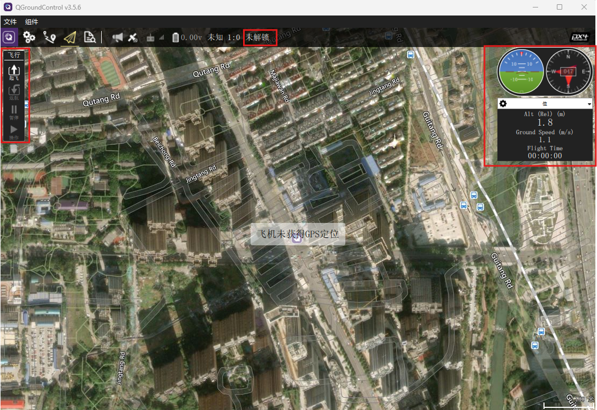
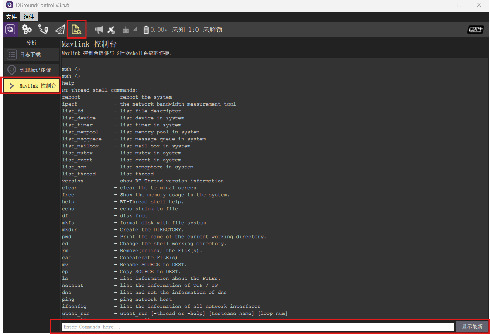

## 连接地面站

使用Type-C数据线连接飞控和PC，Type-C可为飞控供电，同时用于跟飞控的数据传输（USB虚拟串口）。地面站**推荐使用QGC 3.5.6版本**。

### 查看设备号

#### Windows：

打开设备管理器，可以看到飞控的端口号为`COM108`。

  

    
  

> 不同飞控硬件的端口号可能会不一致，Windows系统会为每个硬件分配一个独立的端口号，具体以设备管理器显示的端口号为准。

#### Linux:

在Linux系统下飞控设备一般为`/dev/ttyACM0`，可以在控制台输入`ls /dev/tty*`指令查看飞控对应的设备。

> 可以在飞控插入前后输入指令，查看新增设备即可知道飞控对应的设备名称。

### 地面站连接

打开QGC地面站，选择*通讯连接->添加*按钮

  

    
  

类型选择*Serial*，串口选择飞控对应的设备号，波特率可以设置任意值，因为波特率对USB虚拟串口没有影响。点击*确认*添加通讯设备。

  

    
  

选中刚添加的通讯设备，点击*连接*按钮。

  

    
  

### 地面站基本使用

地面站连接上飞控后，可以在载具设置界面对飞控进行一些设置，如传感器校准、电源设置、参数查看/修改等。**其它界面暂未支持，请勿使用**。

> 连接上地面站可能会看到一些警告信息，可以忽略。这是因为QGC地面站使用的是针对PX4的版本，跟FMT存在一些兼容性问题。我们会后续发布针对FMT的QGC软件来解决兼容性问题，提升用户体验。

  

    
  

在飞机状态界面可以查看飞控的基础状态信息，如姿态、航向角、高度、飞行速度等。同时，也可以点击上方的*未解锁按钮*然后拖动滑块来发送解锁/上锁指令，以及左侧的*起飞/返航/暂停*等按钮。

  

    
  

点击*分析->Mavlink控制台*按钮，可以进入到飞控的控制台界面，在下方的输入框敲击两下回车可以激活控制台，并可在里面输入飞控能识别的指令。比如输入`help`指令回显示飞控当前支持的所有指令。点击输入框右侧*显示最新*，会显示最新的控制台输出。

  

    
  
