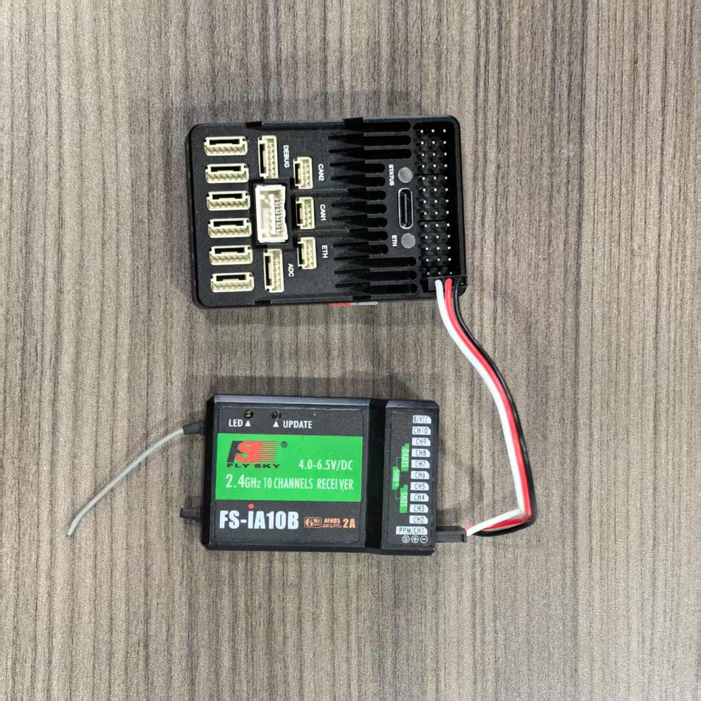
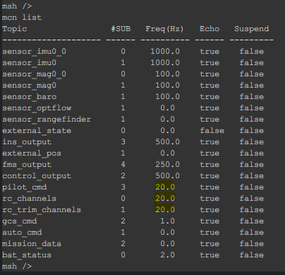
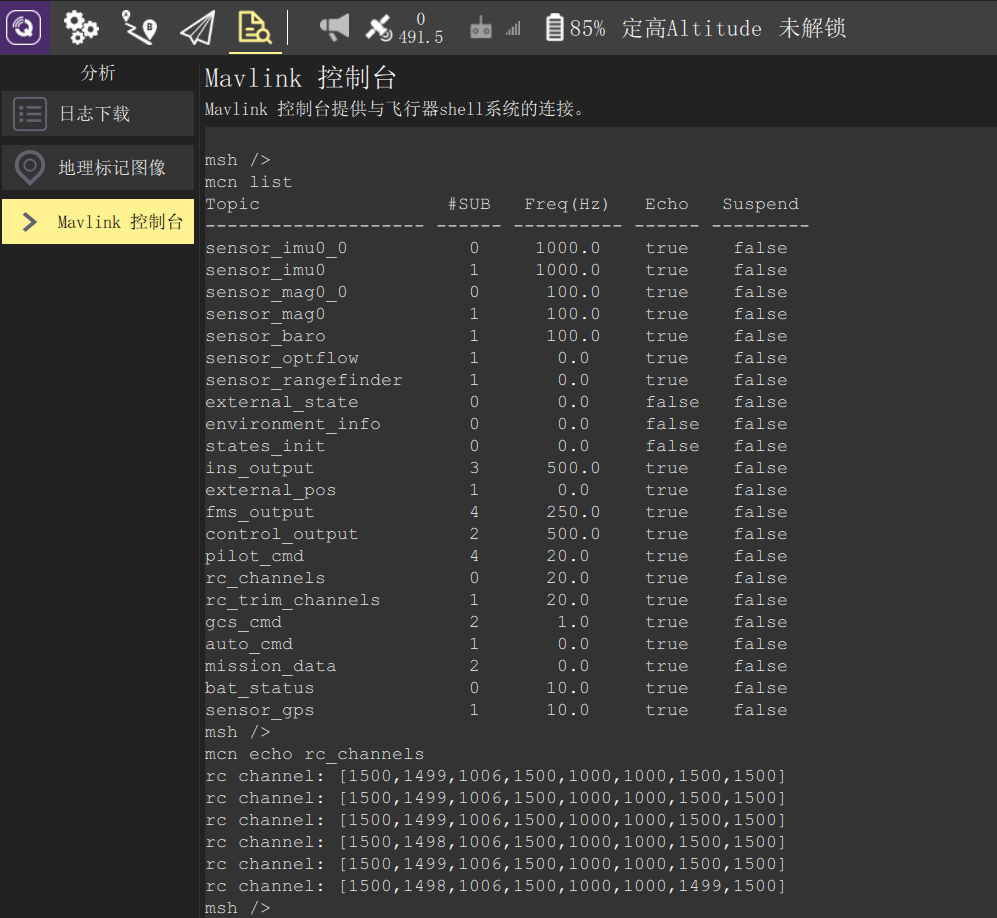
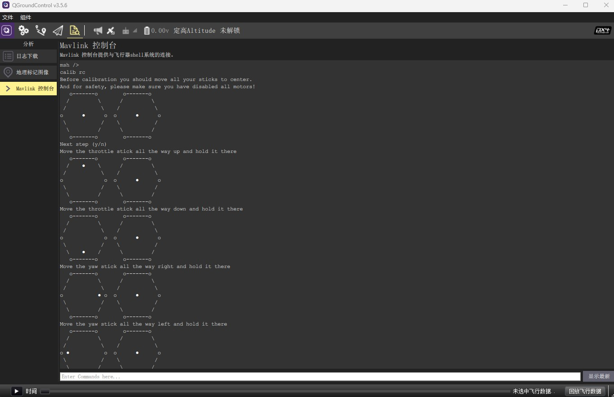

## 使用遥控器

在使用遥控器前，请确保已经上传过正确是配置文件以启动遥控功能，否则请参照上一章节的内容上传配置文件。

### 连接接收机

请将遥控器的接收机的SBUS或PPM信号以及GND连接到飞控的RCin端口，如下图所示。飞控会自动识别输入信号的是SBUS还是PPM。

  

> 请确保接收机和遥控已经对频过，且接收机的输出信号配置为SBUS或PPM。

### 查看遥控信号

在飞控控制台输入`mcn list`指令，若有收到遥控器数据，则跟遥控相关的主题的发布频率（**Freq**）为非0。

  

遥控相关的主题如下：

- **rc_channels**：遥控器原始通道信号
- **rc_trim_channels**：经过校准后的遥控器通道信号
- **pilot_cmd**：经过通道映射以后的遥控信号，该信号为飞控最终所使用的遥控信号。

可在控制台输入`mcn echo + <主题>`来打印主题内容，如输入`mcn echo rc_channels`可以输入遥控器各通道的原始数值：

  

### 遥控器校准

若使用新的遥控器，需对其各通道值进行校准，以使其通道数值位于1000~2000之间，且1500为中位值。在校准遥控器前，请确保可以正常读到遥控器信号，并且摇杆映射配置正确。

> 摇杆配置正确是指将RC的对应摇杆通道映射到了Stick_Throttle油门、Stick_Yaw偏航、Stick_Roll横滚和Stick_Pitch俯仰，且摇杆打到最下和最左为最小值1000，打到最上和最右为最大值2000，中间为中位值1500。映射后的摇杆值可以通过`pilot_cmd`消息查看，若映射不正确，请参照*遥控配置*章节对摇杆映射进行正确配置。若发现摇杆的方向反了，则需在遥控器中设置对应通道反向。

在控制台输入`calib rc`指令，并按照提示进行遥控校准。校准完成后，校准参数将更新到`RC`参数组中，可以通过`param list RC`指令查看。`rc_trim_channels`消息是由原始遥控消息`rc_channels`校准后得到的，校准后的最大、最小和中值应该分别为2000，1000和1500。

> 确认校准参数无误后，请记得在控制台输入`param save`保存校准结果，否则系统断电将丢失未保存的校准结果。

  

