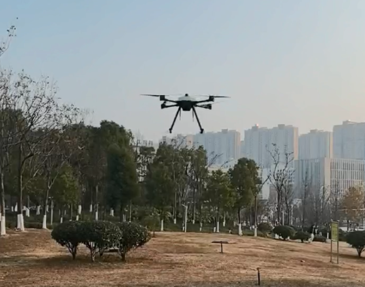

# 实机飞行

无人机实机飞行需要确保安全，飞行前请严格遵守以下注意事项。

> 飞控默认参数仅针对标准机型适配，不能满足所有机型的稳定控制。若您的机型跟标准机型相差过大，请参照参数调整章节进行调参或联系FMT官方团队获得技术支持。

#### 飞行前检查

- 飞行前检查桨叶安装方向和顺序是否正确，否则安装错误将直接导致飞机侧翻。
- 检查飞控数传以及遥控器是否信号连接正常，遥控器电量是否充足。
- 检查无人机电池状态，电量是否充足。
- 检查飞行模式，是否跟设定飞行模式一致。若不一致则可能发生了控制模式降级，需检查传感器状态。
- 检查天气状况，禁止在大风，雷雨等天气下测试和飞行。
- 禁止在靠近人群，建筑物等人员密集场所和禁飞区域飞行。
- 起飞前尽量让飞机处于平地位置，倾斜角度不宜过大。
- 飞机需由专业飞手操纵，并且飞手充分了解飞机的操作流程和操作方式。

#### 飞行中注意事项

- 所有人员在飞行过程中需跟无人机保证足够的安全距离，不可用手触碰或近距离观察。
- 建议使用Position模式飞行。不建议没有丰富飞行经验的飞手进行Altitude定高和Stabilize定点模式 飞行。
- 飞行中必须时刻关注地面站的情况。若发生位置传感器失效导致控制模式降级（从Position变为Altitude或Stabilize），飞手应冷静的操控飞机在定高/自稳模式下安全飞行或者返航降落。
- 若Position定点控制飞行中飞机突然位置乱窜，有可能位置传感器发生异常。在这种情况下，应及时退出Position模式，将模式切换为Altitude或Stabilize。
- 若飞机出现触地无法上锁或者即将装上障碍物或人群，应立即按下紧急上锁键，让电机停桨。

#### 自主安全保护机制

飞控在某些情况下将自动触发安全保障机制，以尽可能保障无人机的飞行安全。飞手需了解这些安全机制，以应对可能的突发情况。

- **飞行模式降级保护**：当飞机丢失GPS等定位传感器准确数据，控制模式将进行降级，一般降级为 Altitude定高模式，以保证飞行稳定。若高度传感器也失效，将继续降级为自稳模式。
- **遥控失联保护**：当手动模式飞行时，若发生遥控失联，若飞控位置信息有效，飞机将 进入定点悬停模式，否则将触发紧急降落。这时可以尝试拉进遥控器、重新开关遥控，或者绕过遥控和飞机之间障碍物， 尝试恢复遥控信号重连。若不能恢复遥控信号，可以通过地面站发送降落或者返航指令，让飞机安全着陆。
- **断连保护**：若遥控信号和地面站数据链同时与飞机失联，飞机将进入悬停10s，10s后若信号仍未恢 复，将自动返航。
- **紧急降落**：若发生遥控信号（地面站）和GPS定位信号同时丢失，飞机将无法进入悬停模式，也无法按照GPS航点实现返航。这时飞机将触发紧急降落模式，在保持姿态水平的情况下，缓慢降低高度。

Enjoy Fly!

  

