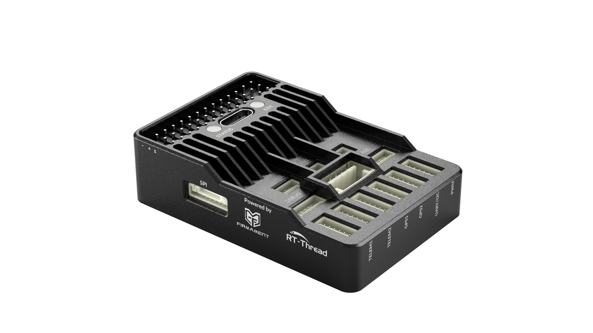

# SIEON S1使用手册

**SIEON S1**是由FMT官方团队（长沙释云科技有限公司）匠心打造的一款专业级、高性能的开源自驾仪硬件。S1搭载了最新的STM32H743（Cortex-M7）芯片，拥有高达480MHz主频，1MB RAM和2MB Flash空间，内置FPU浮点加速单元，提供更大算力和内存空间。

S1除了提供标准的外部接口，如串口、SPI、IIC、PWM、USB等，还提供了CAN总线接口和ETH以太网接口，满足工业场景应用和网络高带宽数据传输场景。S1具有体积小、重量轻的有点，结构尺寸为56.0mm * 37.0mm * 13.0mm，重量仅为40.5g。

S1搭载了FMT固件，可用于无人机，无人车，无人船和机器人等应用领域。FMT是下一代开源智驾仪系统，支持基于模型开发（Model-based-design，MBD）。使用MATLAB/Simulink以图形化方式快速搭建算法模型，一键代码自动生成轻松部署到飞控硬件上，大大提高科研和研发效率，是先进算法验证、二次开发的理想平台。

  

    
  
