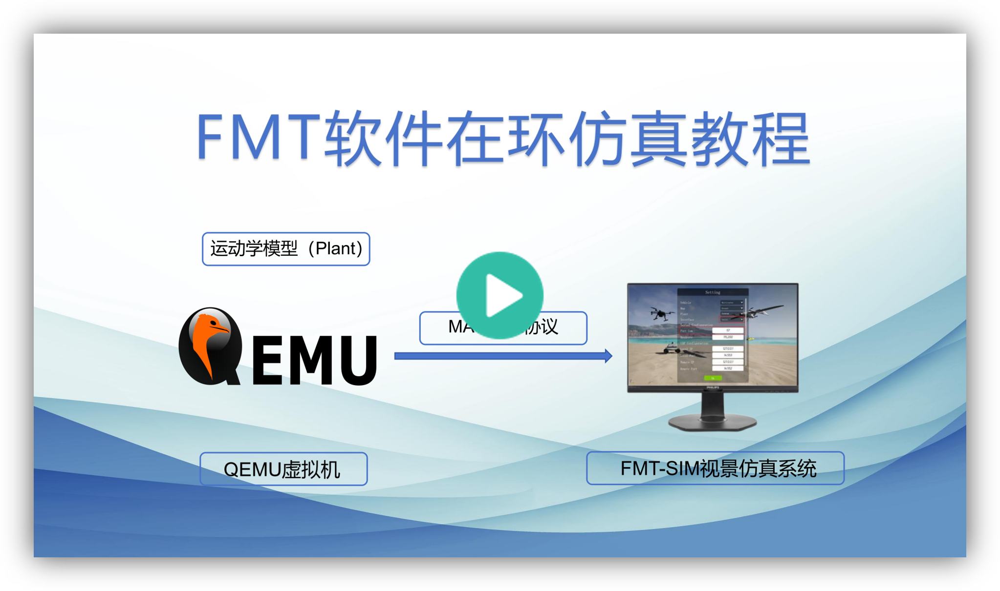
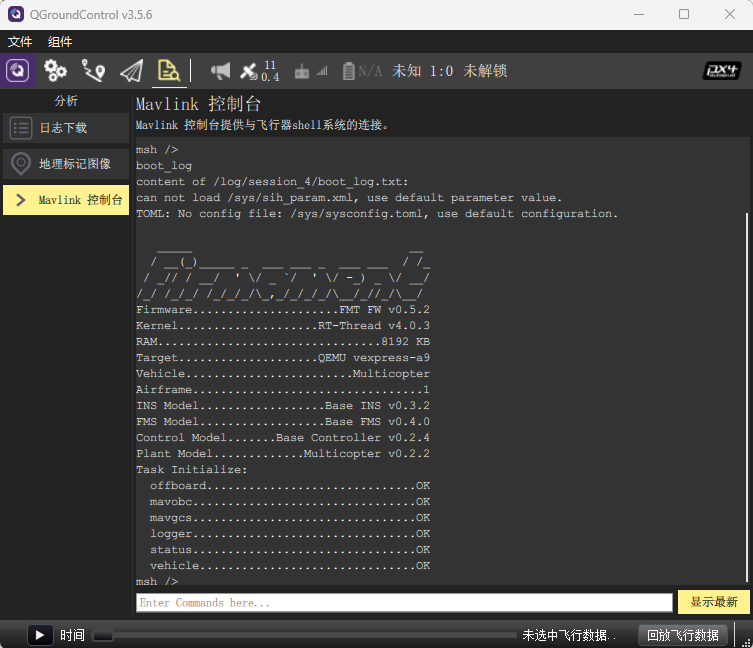

# 软件在环仿真

软件在环仿真（Software-in-loop Simulation，SIL）是将源代码编译并在主机计算机上运行，为详细的控制策略和系统功能开发与测试提供实用的虚拟仿真环境。相比于MIL仿真，SIL仿真更进一步，其将模型代码生成并部署到飞控嵌入式软件中，而不同于HIL仿真，SIL并非运行于实际的飞控硬件，而是一般运行在PC上。

FMT的SIL环境是基于QEMU构建的。通过在QEMU中创建虚拟硬件来让FMT在您的主机PC上运行。

如果您之前没有安装QEMU，您需要首先安装[QEMU (qemu-system-arm)](https://www.qemu.org/download/)。您可以访问QEMU的下载网站。安装完成后，您可以输入以下命令来查看版本信息：

```
qemu-system-arm --version
QEMU emulator version 7.1.94 (v7.2.0-rc4-11947-g2dabd50cfb-dirty)
Copyright (c) 2003-2022 Fabrice Bellard and the QEMU Project developers
```

#### 视频教程

<p align="center">
  <a href="https://www.bilibili.com/video/BV1RE5VzmEzo/?spm_id_from=333.1387.homepage.video_card.click&vd_source=e10fbad513d60d80778c4c6977e370a9" target="_blank">
    
  </a>
</p>

#### 使用SIL

首先进入QEMU的BSP目录，并进行编译：

```
cd FMT-Firmware/target/qemu/qemu-vexpress-a9
scons -j4
```

编译完成后，在系统终端运行`qemu.bat`（**Windows**）或`qemu.sh`（Linux，Mac）：

```
PS D:\ws\FMT\FMT-Firmware\target\qemu\qemu-vexpress-a9> .\qemu.bat
[I/SDIO] SD card capacity 65536 KB.
parameter loaded from /sys/sih_param.xml
TOML: No config file finded: /sys/sysconfig.toml
Default configuration loaded.

   _____                               __
  / __(_)_____ _  ___ ___ _  ___ ___  / /_
 / _// / __/  ' \/ _ `/  ' \/ -_) _ \/ __/
/_/ /_/_/ /_/_/_/\_,_/_/_/_/\__/_//_/\__/
Firmware.....................FMT FW v1.1.0
Kernel....................RT-Thread v4.0.3
RAM................................8192 KB
Target....................QEMU vexpress-a9
Vehicle........................Multicopter
Airframe.................................1
INS Model....................CF INS v1.0.0
FMS Model....................MC FMS v1.0.0
Control Model.........MC Controller v1.0.0
Plant Model.............Multicopter v1.0.0
Task Initialize:
  offboard..............................OK
  mavobc................................OK
  mavgcs................................OK
  logger................................OK
  status................................OK
  vehicle...............................OK
[1102] I/StatusTask: SIH Simulation
```

打开QGC地面站，当QEMU启动并运行时，QGC会自动链接：

<p align="center">
  
</p>
