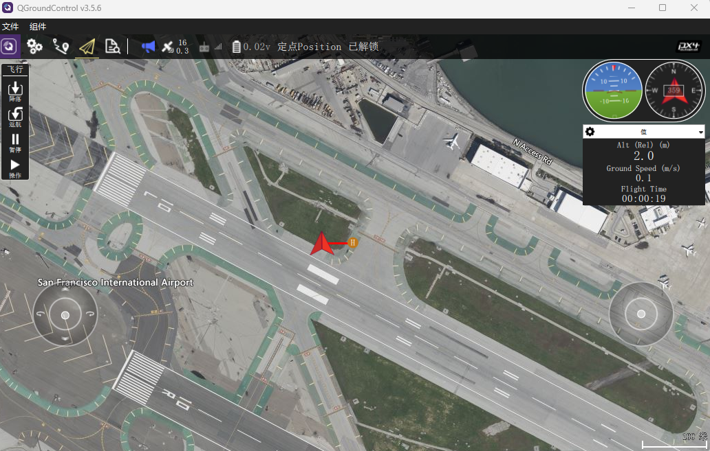
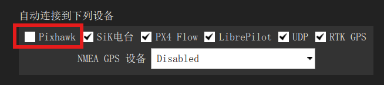

# 模拟飞行

对于首次飞行或者对飞行操作还不熟悉的用户，建议先使用 SIH （Simulation-In-Hardware）模式进行飞行练习。SIH 仿真模式将数字模拟飞机集成到飞控中，其操作与真实飞行器几乎完全一致，你可以体验各种飞行控制模式的区别，连接地面站，航点任务飞行，连接外部器件等操作。

要使用SIH模式，输入如下指令编译固件

```
FMT\FMT-Firmware\target\infineon\edge-e83\m55> scons -j16 --sim=SIH
```

> 默认编译的是X型四旋翼固件，其它机型编译指令会不同，具体请参考FMT官方文档。

编译完成后将固件下载到飞控中

```
FMT\FMT-Firmware\target\infineon\edge-e83\m55> python.exe .\uploader.py
```

将飞控连接到地面站，即可通过地面站看到飞控状态，以及给飞控发送指令（如解锁/上锁，起飞，降落，返航等）。

<p align="left">
  
</p>

SIH仿真模式下，在控制台输入`boot_log`指令，可以看到除了常规算法模型（INS，FMS，Controller）外，多了一个Plant被控对象模型。该模型就是数字模拟飞机，它将模拟被控对象的动力学和传感器。

```
msh />boot_log
content of /log/session_1/boot_log.txt:
can not load /sys/sih_param.xml, use default parameter value.

   _____                               __
  / __(_)_____ _  ___ ___ _  ___ ___  / /_
 / _// / __/  ' \/ _ `/  ' \/ -_) _ \/ __/
/_/ /_/_/ /_/_/_/\_,_/_/_/_/\__/_//_/\__/
Firmware.....................FMT FW v1.0.0
Kernel....................RT-Thread v4.0.3
RAM................................1408 KB
Target............................Edge-E83
Vehicle........................Multicopter
Airframe.................................1
INS Model....................CF INS v1.0.0
FMS Model....................MC FMS v1.0.0
Control Model.........MC Controller v1.0.0
Plant Model.............Multicopter v1.0.0
Task Initialize:
  mavobc................................OK
  mavgcs................................OK
  logger................................OK
  status................................OK
  vehicle...............................OK
```

#### 使用视景可视化软件

在SIH仿真时，可使用FMT-SIM视景可视化软件，来提供更为逼真的可视化效果。

首先需断开QGC地面站跟飞控的连接，这是为了让FMT-SIM可以通过USB端口连接到飞控。连接上飞控后，FMT-SIM将自动连接飞控到地面站。

打开FMT-SIM的Settings设置界面，按照如下进行设置，其中Serial的端口号设置为飞控的端口号。

<p align="left">
  
</p>

返回并点击Start开始游戏，飞控将连接上FMT-SIM视景可视化系统和地面站。

<p align="left">
  
</p>

注意，为了不让地面站占用FMT-SIM连接飞控的链路，请取消地面站自动连接飞控的选项。

<p align="left">
  
</p>