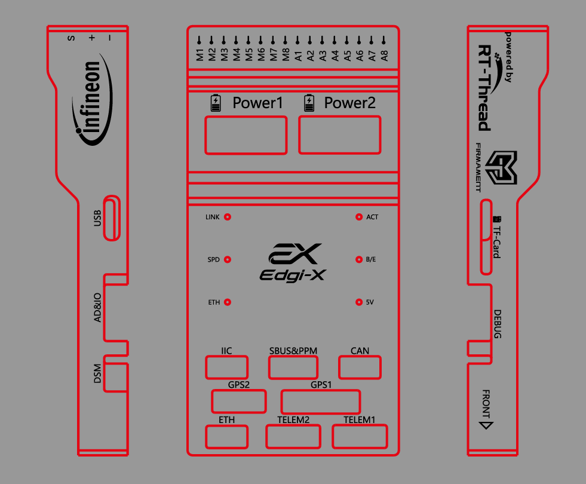
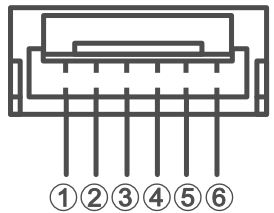

请参见下方图示，了解引脚1的位置。除非另有说明，所有连接器均为JST GH 1.25毫米间距。

**Power1 (Main) & Power2 Port (Backup)**  (2.00mm Pitch CLIK-Mate)

| PIN  | Signal   | Volt  |
| :--- | :------- | ----- |
| 1    | VDD5V1/2 | +5V   |
| 2    | VDD5V1/2 | +5V   |
| 3    | SCL      | +3.3V |
| 4    | SDA      | +3.3V |
| 5    | GND      | GND   |
| 6    | GND      | GND   |

**Telem1, Telem2 ports**

| PIN  | Signal      | Volt  |
| :--- | :---------- | ----- |
| 1    | VCC         | +5V   |
| 2    | TX1/2(out)  | +3.3V |
| 3    | RX1/2(in)   | +3.3V |
| 4    | CTS1/2(in)  | +3.3V |
| 5    | RTS1/2(out) | +3.3V |
| 6    | GND         | GND   |

**GPS1 ports**

| PIN  | Signal            | Volt  |
| :--- | :---------------- | ----- |
| 1    | VCC               | +5V   |
| 2    | TX9(out)          | +3.3V |
| 3    | RX9(in)           | +3.3V |
| 4    | SCL5              | +3.3V |
| 5    | SDA5              | +3.3V |
| 6    | SAFETY_SWITCH     | +3.3V |
| 7    | SAFETY_SWITCH_LED | +3.3V |
| 8    | VDD_3V3           | +3.3V |
| 9    | BUZZER-           | 0~5V  |
| 10   | GND               | GND   |

**GPS2 ports**

| PIN  | Signal    | Volt  |
| :--- | :-------- | ----- |
| 1    | VCC       | +5V   |
| 2    | TX10(out) | +3.3V |
| 3    | RX10(in)  | +3.3V |
| 4    | SCL5(in)  | +3.3V |
| 5    | SDA5(out) | +3.3V |
| 6    | GND       | GND   |

**CAN ports**

| PIN  | Signal | Volt  |
| :--- | :----- | ----- |
| 1    | VCC    | +5V   |
| 2    | CANH   | +3.3V |
| 3    | CANL   | +3.3V |
| 4    | GND    | GND   |

**IIC ports**

| PIN  | Signal | Volt  |
| :--- | :----- | ----- |
| 1    | VCC    | +5V   |
| 2    | SCL    | +3.3V |
| 3    | SDA    | +3.3V |
| 4    | GND    | GND   |

**ETH ports**

| PIN  | Signal | Volt  |
| :--- | :----- | ----- |
| 1    | RXN    | +3.3V |
| 2    | RXP    | +3.3V |
| 3    | SDA    | +3.3V |
| 4    | TXP    | +3.3V |

**AD&IO ports**

| PIN  | Signal  | Volt    |
| :--- | :------ | ------- |
| 1    | VCC     | +5V     |
| 2    | IO_1    | +3.3V   |
| 3    | IO_2    | +3.3V   |
| 4    | IO_3    | +3.3V   |
| 5    | IO_4    | +3.3V   |
| 6    | ADC_3V3 | +0~3.3V |
| 7    | ADC_6V6 | +0~6.6V |
| 8    | GND     | GND     |

**SBUS&PPM ports**

| PIN  | Signal         | Volt  |
| :--- | :------------- | ----- |
| 1    | VCC            | +5V   |
| 2    | PPM/SBUS_INPUT | +3.3V |
| 3    | NC             | --    |
| 4    | SBUS_OUTPUT    | +3.3V |
| 5    | GND            | GND   |

**DSM ports**

| PIN  | Signal | Volt  |
| :--- | :----- | ----- |
| 1    | VCC    | +3.3V |
| 2    | DSM    | +3.3V |
| 3    | GND    | GND   |

**PWM OUT ports**

| PIN  | Signal      | Volt    |
| :--- | :---------- | ------- |
| S    | M1-M8/A1-A8 | +3.3V   |
| +    | VDD_SERVO   | 0~13.8V |
| -    | GND         | GND     |

**DEBUG ports**

| PIN  | Signal     | Volt  |
| :--- | :--------- | ----- |
| 1    | VREF       | +1.8V |
| 2    | TX(out)    | +3.3V |
| 3    | RX(in)     | +3.3V |
| 4    | TMS_SWDIO  | +1.8V |
| 5    | TCLK_SWCLK | +1.8V |
| 6    | TDO_SWO    | +1.8V |
| 7    | TDI        | +1.8V |
| 8    | NC         | --    |
| 9    | XRES       | +1.8V |
| 10   | GND        | GND   |
